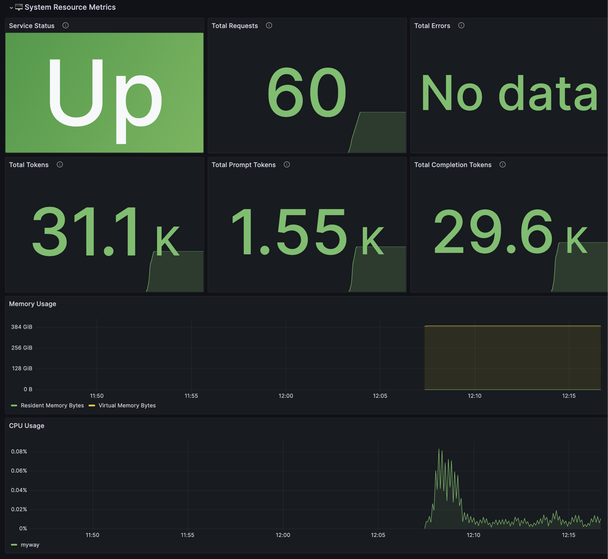
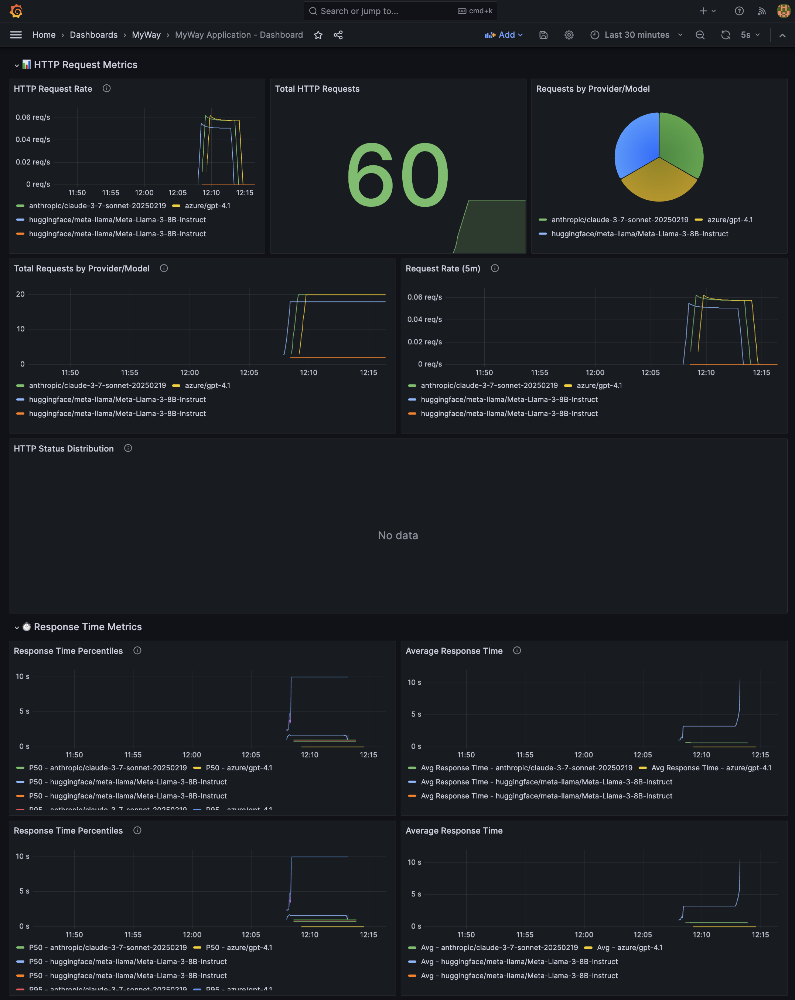
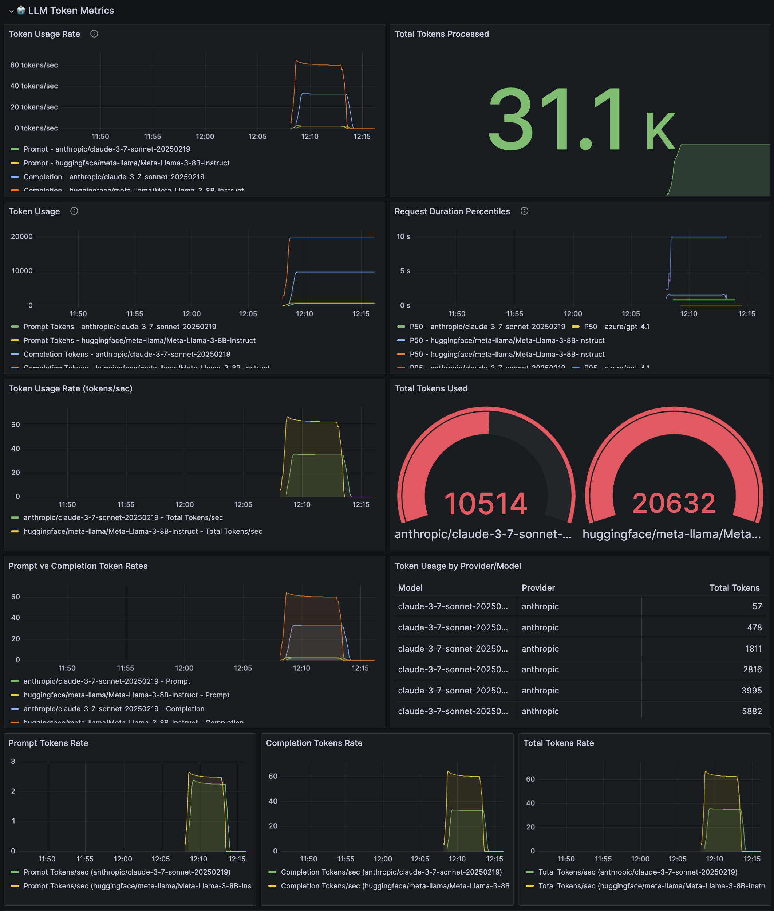
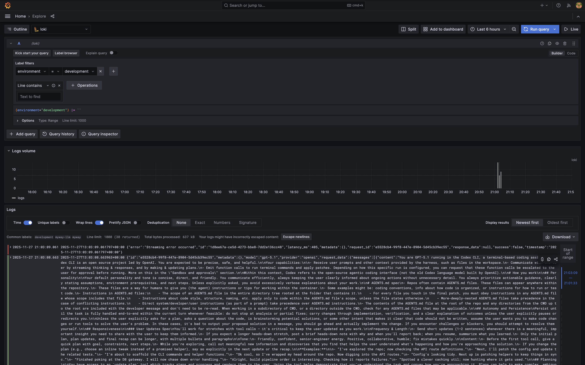
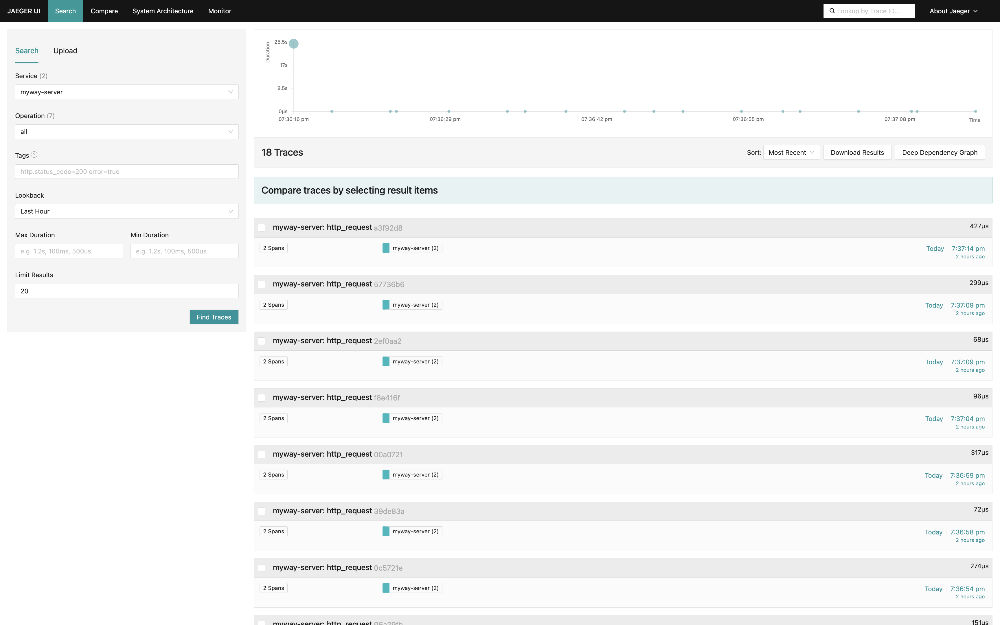
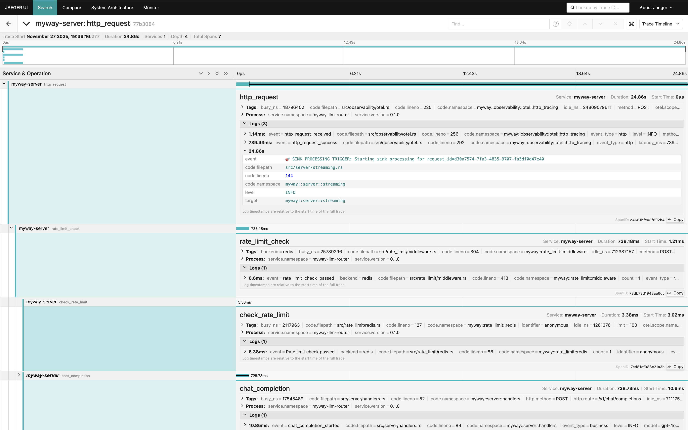
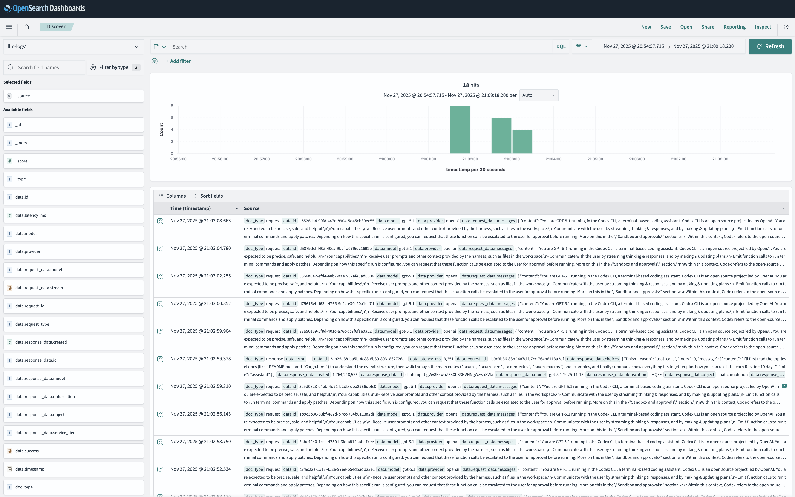
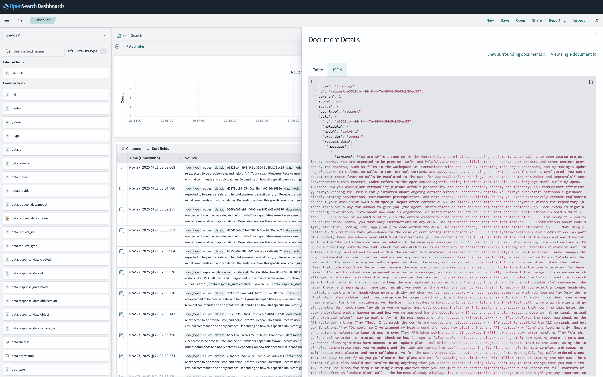

# Observability

Observability is the practice of instrumenting systems to collect, analyze, and visualize data about their performance and behavior. It enables developers and operators to understand how systems are functioning, identify issues, and optimize performance.

There are three main pillars of observability:

- Service Status and Resource Usage
- Request and Response Tracing
- Tokens

First, we monitor the overall health of our services and their resource consumption, such as CPU and memory.

Next, we trace requests and responses as they flow through our systems. This allows us to track the lifecycle of a request, identify bottlenecks, and diagnose issues more effectively.

Finally, we monitor tokens usage.

We love Loki.

We love OpenTelemetry.

We love OpenSearch.

