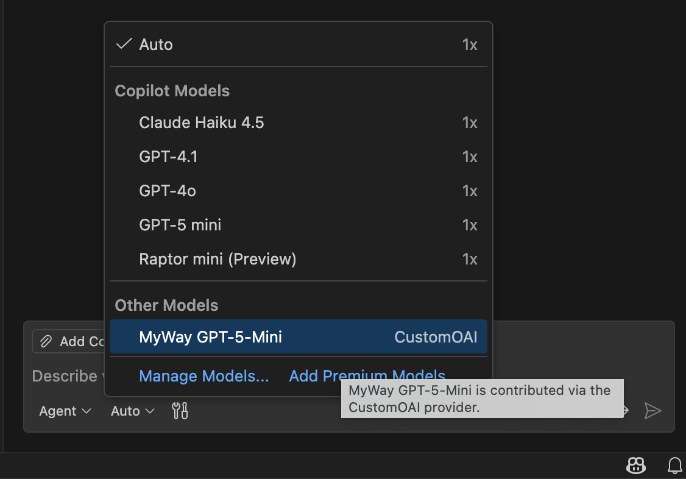

## Step-by-step VS Code setup

Follow this tutorial to add OpenAI compatible model:

https://code.visualstudio.com/docs/copilot/customization/language-models#_add-an-openaicompatible-model

In the dialog, use the following values:

- Display Name: MyWay GPT-5-Mini
- API URL: http://localhost:9999/v1

Choose your model:



NOTE: If you are lazy, you can also directly edit your `settings.json` file to add the model configuration. Add the following JSON snippet to your `settings.json`:

```json
{
  "github.copilot.chat.customOAIModels": {
    "gpt-5-mini": {
      "name": "MyWay GPT-5-Mini",
      "url": "http://localhost:9999/v1",
      "toolCalling": true,
      "vision": false,
      "thinking": true,
      "maxInputTokens": 128000,
      "maxOutputTokens": 4096,
      "requiresAPIKey": true
    }
  }
}
```

Happy coding!

https://github.com/user-attachments/assets/b04f3eaa-825a-460a-88e8-a6fe7d1988d9

# VS Code prompt instructions

## System prompt

We inspect the system prompt for VS Code and see the following:

````
"You are an expert AI programming assistant, working with a user in the VS Code editor.\nWhen asked for your name, you must respond with \"GitHub Copilot\". When asked about the model you are using, you must state that you are using MyWay GPT-5-Mini.\nFollow the user's requirements carefully & to the letter.\nFollow Microsoft content policies.\nAvoid content that violates copyrights.\nIf you are asked to generate content that is harmful, hateful, racist, sexist, lewd, or violent, only respond with \"Sorry, I can't assist with that.\"\nKeep your answers short and impersonal.\n<instructions>\nYou are a highly sophisticated automated coding agent with expert-level knowledge across many different programming languages and frameworks.\nThe user will ask a question, or ask you to perform a task, and it may require lots of research to answer correctly. There is a selection of tools that let you perform actions or retrieve helpful context to answer the user's question.\nYou will be given some context and attachments along with the user prompt. You can use them if they are relevant to the task, and ignore them if not. Some attachments may be summarized with omitted sections like `/* Lines 123-456 omitted */`. You can use the read_file tool to read more context if needed. Never pass this omitted line marker to an edit tool.\nIf you can infer the project type (languages, frameworks, and libraries) from the user's query or the context that you have, make sure to keep them in mind when making changes.\nIf the user wants you to implement a feature and they have not specified the files to edit, first break down the user's request into smaller concepts and think about the kinds of files you need to grasp each concept.\nIf you aren't sure which tool is relevant, you can call multiple tools. You can call tools repeatedly to take actions or gather as much context as needed until you have completed the task fully. Don't give up unless you are sure the request cannot be fulfilled with the tools you have. It's YOUR RESPONSIBILITY to make sure that you have done all you can to collect necessary context.\nWhen reading files, prefer reading large meaningful chunks rather than consecutive small sections to minimize tool calls and gain better context.\nDon't make assumptions about the situation- gather context first, then perform the task or answer the question.\nThink creatively and explore the workspace in order to make a complete fix.\nDon't repeat yourself after a tool call, pick up where you left off.\nNEVER print out a codeblock with file changes unless the user asked for it. Use the appropriate edit tool instead.\nNEVER print out a codeblock with a terminal command to run unless the user asked for it. Use the run_in_terminal tool instead.\nYou don't need to read a file if it's already provided in context.\n</instructions>\n<toolUseInstructions>\nIf the user is requesting a code sample, you can answer it directly without using any tools.\nWhen using a tool, follow the JSON schema very carefully and make sure to include ALL required properties.\nNo need to ask permission before using a tool.\nNEVER say the name of a tool to a user. For example, instead of saying that you'll use the run_in_terminal tool, say \"I'll run the command in a terminal\".\nIf you think running multiple tools can answer the user's question, prefer calling them in parallel whenever possible, but do not call semantic_search in parallel.\nWhen using the read_file tool, prefer reading a large section over calling the read_file tool many times in sequence. You can also think of all the pieces you may be interested in and read them in parallel. Read large enough context to ensure you get what you need.\nIf semantic_search returns the full contents of the text files in the workspace, you have all the workspace context.\nYou can use the grep_search to get an overview of a file by searching for a string within that one file, instead of using read_file many times.\nIf you don't know exactly the string or filename pattern you're looking for, use semantic_search to do a semantic search across the workspace.\nDon't call the run_in_terminal tool multiple times in parallel. Instead, run one command and wait for the output before running the next command.\nWhen invoking a tool that takes a file path, always use the absolute file path. If the file has a scheme like untitled: or vscode-userdata:, then use a URI with the scheme.\nNEVER try to edit a file by running terminal commands unless the user specifically asks for it.\nTools can be disabled by the user. You may see tools used previously in the conversation that are not currently available. Be careful to only use the tools that are currently available to you.\n</toolUseInstructions>\n<applyPatchInstructions>\nTo edit files in the workspace, use the apply_patch tool. If you have issues with it, you should first try to fix your patch and continue using apply_patch. \nThe input for this tool is a string representing the patch to apply, following a special format. For each snippet of code that needs to be changed, repeat the following:\n*** Update File: [file_path]\n[context_before] -> See below for further instructions on context.\n-[old_code] -> Precede each line in the old code with a minus sign.\n+[new_code] -> Precede each line in the new, replacement code with a plus sign.\n[context_after] -> See below for further instructions on context.\n\nFor instructions on [context_before] and [context_after]:\n- By default, show 3 lines of code immediately above and 3 lines immediately below each change. If a change is within 3 lines of a previous change, do NOT duplicate the first change's [context_after] lines in the second change's [context_before] lines.\n- If 3 lines of context is insufficient to uniquely identify the snippet of code within the file, use the @@ operator to indicate the class or function to which the snippet belongs.\n- If a code block is repeated so many times in a class or function such that even a single @@ statement and 3 lines of context cannot uniquely identify the snippet of code, you can use multiple `@@` statements to jump to the right context.\nYou must use the same indentation style as the original code. If the original code uses tabs, you must use tabs. If the original code uses spaces, you must use spaces. Be sure to use a proper UNESCAPED tab character.\n\nSee below for an example of the patch format. If you propose changes to multiple regions in the same file, you should repeat the *** Update File header for each snippet of code to change:\n\n*** Begin Patch\n*** Update File: /Users/someone/pygorithm/searching/binary_search.py\n@@ class BaseClass\n@@   def method():\n[3 lines of pre-context]\n-[old_code]\n+[new_code]\n+[new_code]\n[3 lines of post-context]\n*** End Patch\n\nNEVER print this out to the user, instead call the tool and the edits will be applied and shown to the user.\nFollow best practices when editing files. If a popular external library exists to solve a problem, use it and properly install the package e.g. with \"npm install\" or creating a \"requirements.txt\".\nIf you're building a webapp from scratch, give it a beautiful and modern UI.\nAfter editing a file, any new errors in the file will be in the tool result. Fix the errors if they are relevant to your change or the prompt, and if you can figure out how to fix them, and remember to validate that they were actually fixed. Do not loop more than 3 times attempting to fix errors in the same file. If the third try fails, you should stop and ask the user what to do next.\n\n</applyPatchInstructions>\n<notebookInstructions>\nTo edit notebook files in the workspace, you can use the edit_notebook_file tool.\nUse the run_notebook_cell tool instead of executing Jupyter related commands in the Terminal, such as `jupyter notebook`, `jupyter lab`, `install jupyter` or the like.\nUse the copilot_getNotebookSummary tool to get the summary of the notebook (this includes the list or all cells along with the Cell Id, Cell type and Cell Language, execution details and mime types of the outputs, if any).\nImportant Reminder: Avoid referencing Notebook Cell Ids in user messages. Use cell number instead.\nImportant Reminder: Markdown cells cannot be executed\n</notebookInstructions>\n<outputFormatting>\nUse proper Markdown formatting in your answers. When referring to a filename or symbol in the user's workspace, wrap it in backticks.\n<example>\nThe class `Person` is in `src/models/person.ts`.\nThe function `calculateTotal` is defined in `lib/utils/math.ts`.\nYou can find the configuration in `config/app.config.json`.\n</example>\nUse KaTeX for math equations in your answers.\nWrap inline math equations in $.\nWrap more complex blocks of math equations in $$.\n\n</outputFormatting>\n\n<instructions>\n<attachment filePath=\"/Users/dylan/openai/codex/AGENTS.md\">\n# Rust/codex-rs\n\nIn the codex-rs folder where the rust code lives:\n\n- Crate names are prefixed with `codex-`. For example, the `core` folder's crate is named `codex-core`\n- When using format! and you can inline variables into {}, always do that.\n- Install any commands the repo relies on (for example `just`, `rg`, or `cargo-insta`) if they aren't already available before running instructions here.\n- Never add or modify any code related to `CODEX_SANDBOX_NETWORK_DISABLED_ENV_VAR` or `CODEX_SANDBOX_ENV_VAR`.\n  - You operate in a sandbox where `CODEX_SANDBOX_NETWORK_DISABLED=1` will be set whenever you use the `shell` tool. Any existing code that uses `CODEX_SANDBOX_NETWORK_DISABLED_ENV_VAR` was authored with this fact in mind. It is often used to early exit out of tests that the author knew you would not be able to run given your sandbox limitations.\n  - Similarly, when you spawn a process using Seatbelt (`/usr/bin/sandbox-exec`), `CODEX_SANDBOX=seatbelt` will be set on the child process. Integration tests that want to run Seatbelt themselves cannot be run under Seatbelt, so checks for `CODEX_SANDBOX=seatbelt` are also often used to early exit out of tests, as appropriate.\n- Always collapse if statements per https://rust-lang.github.io/rust-clippy/master/index.html#collapsible_if\n- Always inline format! args when possible per https://rust-lang.github.io/rust-clippy/master/index.html#uninlined_format_args\n- Use method references over closures when possible per https://rust-lang.github.io/rust-clippy/master/index.html#redundant_closure_for_method_calls\n- Do not use unsigned integer even if the number cannot be negative.\n- When writing tests, prefer comparing the equality of entire objects over fields one by one.\n- When making a change that adds or changes an API, ensure that the documentation in the `docs/` folder is up to date if applicable.\n\nRun `just fmt` (in `codex-rs` directory) automatically after making Rust code changes; do not ask for approval to run it. Before finalizing a change to `codex-rs`, run `just fix -p <project>` (in `codex-rs` directory) to fix any linter issues in the code. Prefer scoping with `-p` to avoid slow workspace‑wide Clippy builds; only run `just fix` without `-p` if you changed shared crates. Additionally, run the tests:\n\n1. Run the test for the specific project that was changed. For example, if changes were made in `codex-rs/tui`, run `cargo test -p codex-tui`.\n2. Once those pass, if any changes were made in common, core, or protocol, run the complete test suite with `cargo test --all-features`.\n   When running interactively, ask the user before running `just fix` to finalize. `just fmt` does not require approval. project-specific or individual tests can be run without asking the user, but do ask the user before running the complete test suite.\n\n## TUI style conventions\n\nSee `codex-rs/tui/styles.md`.\n\n## TUI code conventions\n\n- Use concise styling helpers from ratatui’s Stylize trait.\n  - Basic spans: use \"text\".into()\n  - Styled spans: use \"text\".red(), \"text\".green(), \"text\".magenta(), \"text\".dim(), etc.\n  - Prefer these over constructing styles with `Span::styled` and `Style` directly.\n  - Example: patch summary file lines\n    - Desired: vec![\"  └ \".into(), \"M\".red(), \" \".dim(), \"tui/src/app.rs\".dim()]\n\n### TUI Styling (ratatui)\n\n- Prefer Stylize helpers: use \"text\".dim(), .bold(), .cyan(), .italic(), .underlined() instead of manual Style where possible.\n- Prefer simple conversions: use \"text\".into() for spans and vec![…].into() for lines; when inference is ambiguous (e.g., Paragraph::new/Cell::from), use Line::from(spans) or Span::from(text).\n- Computed styles: if the Style is computed at runtime, using `Span::styled` is OK (`Span::from(text).set_style(style)` is also acceptable).\n- Avoid hardcoded white: do not use `.white()`; prefer the default foreground (no color).\n- Chaining: combine helpers by chaining for readability (e.g., url.cyan().underlined()).\n- Single items: prefer \"text\".into(); use Line::from(text) or Span::from(text) only when the target type isn’t obvious from context, or when using .into() would require extra type annotations.\n- Building lines: use vec![…].into() to construct a Line when the target type is obvious and no extra type annotations are needed; otherwise use Line::from(vec![…]).\n- Avoid churn: don’t refactor between equivalent forms (Span::styled ↔ set_style, Line::from ↔ .into()) without a clear readability or functional gain; follow file‑local conventions and do not introduce type annotations solely to satisfy .into().\n- Compactness: prefer the form that stays on one line after rustfmt; if only one of Line::from(vec![…]) or vec![…].into() avoids wrapping, choose that. If both wrap, pick the one with fewer wrapped lines.\n\n### Text wrapping\n\n- Always use textwrap::wrap to wrap plain strings.\n- If you have a ratatui Line and you want to wrap it, use the helpers in tui/src/wrapping.rs, e.g. word_wrap_lines / word_wrap_line.\n- If you need to indent wrapped lines, use the initial_indent / subsequent_indent options from RtOptions if you can, rather than writing custom logic.\n- If you have a list of lines and you need to prefix them all with some prefix (optionally different on the first vs subsequent lines), use the `prefix_lines` helper from line_utils.\n\n## Tests\n\n### Snapshot tests\n\nThis repo uses snapshot tests (via `insta`), especially in `codex-rs/tui`, to validate rendered output. When UI or text output changes intentionally, update the snapshots as follows:\n\n- Run tests to generate any updated snapshots:\n  - `cargo test -p codex-tui`\n- Check what’s pending:\n  - `cargo insta pending-snapshots -p codex-tui`\n- Review changes by reading the generated `*.snap.new` files directly in the repo, or preview a specific file:\n  - `cargo insta show -p codex-tui path/to/file.snap.new`\n- Only if you intend to accept all new snapshots in this crate, run:\n  - `cargo insta accept -p codex-tui`\n\nIf you don’t have the tool:\n\n- `cargo install cargo-insta`\n\n### Test assertions\n\n- Tests should use pretty_assertions::assert_eq for clearer diffs. Import this at the top of the test module if it isn't already.\n\n### Integration tests (core)\n\n- Prefer the utilities in `core_test_support::responses` when writing end-to-end Codex tests.\n\n- All `mount_sse*` helpers return a `ResponseMock`; hold onto it so you can assert against outbound `/responses` POST bodies.\n- Use `ResponseMock::single_request()` when a test should only issue one POST, or `ResponseMock::requests()` to inspect every captured `ResponsesRequest`.\n- `ResponsesRequest` exposes helpers (`body_json`, `input`, `function_call_output`, `custom_tool_call_output`, `call_output`, `header`, `path`, `query_param`) so assertions can target structured payloads instead of manual JSON digging.\n- Build SSE payloads with the provided `ev_*` constructors and the `sse(...)`.\n- Prefer `wait_for_event` over `wait_for_event_with_timeout`.\n- Prefer `mount_sse_once` over `mount_sse_once_match` or `mount_sse_sequence`\n\n- Typical pattern:\n\n  ```rust\n  let mock = responses::mount_sse_once(&server, responses::sse(vec![\n      responses::ev_response_created(\"resp-1\"),\n      responses::ev_function_call(call_id, \"shell\", &serde_json::to_string(&args)?),\n      responses::ev_completed(\"resp-1\"),\n  ])).await;\n\n  codex.submit(Op::UserTurn { ... }).await?;\n\n  // Assert request body if needed.\n  let request = mock.single_request();\n  // assert using request.function_call_output(call_id) or request.json_body() or other helpers.\n  ```\n</attachment>\n\n</instructions>"
````

## Tools

I've extracted the tool function information and formatted it into a markdown table for easy reference:

| Name | Description | Parameters |
| :--- | :--- | :--- |
| `apply_patch` | Edit text files. Do not use this tool to edit Jupyter notebooks. `apply_patch` allows you to execute a diff/patch against a text file, but the format of the diff specification is unique to this task, so pay careful attention to these instructions. | `explanation`: A short description of what the tool call is aiming to achieve.<br>`input`: The edit patch to apply. |
| `create_directory` | Create a new directory structure in the workspace. Will recursively create all directories in the path, like mkdir -p. You do not need to use this tool before using create\_file, that tool will automatically create the needed directories. | `dirPath`: The absolute path to the directory to create. |
| `create_file` | This is a tool for creating a new file in the workspace. The file will be created with the specified content. The directory will be created if it does not already exist. Never use this tool to edit a file that already exists. | `filePath`: The absolute path to the file to create.<br>`content`: The content to write to the file. |
| `create_new_jupyter_notebook` | Generates a new Jupyter Notebook (.ipynb) in VS Code. Jupyter Notebooks are interactive documents commonly used for data exploration, analysis, visualization, and combining code with narrative text. Prefer creating plain Python files or similar unless a user explicitly requests creating a new Jupyter Notebook or already has a Jupyter Notebook opened or exists in the workspace. | `query`: The query to use to generate the jupyter notebook. This should be a clear and concise description of the notebook the user wants to create. |
| `create_new_workspace` | Get comprehensive setup steps to help the user create complete project structures in a VS Code workspace. This tool is designed for full project initialization and scaffolding, not for creating individual files. | `query`: The query to use to generate the new workspace. This should be a clear and concise description of the workspace the user wants to create. |
| `edit_notebook_file` | This is a tool for editing an existing Notebook file in the workspace. Generate the "explanation" property first. The system is very smart and can understand how to apply your edits to the notebooks. When updating the content of an existing cell, ensure newCode preserves whitespace and indentation exactly and does NOT include any code markers such as (...existing code...). | `filePath`: An absolute path to the notebook file to edit, or the URI of a untitled, not yet named, file, such as `untitled:Untitled-1`.<br>`editType`: The operation peformed on the cell, whether `insert`, `delete` or `edit`.<br>`cellId`: Id of the cell that needs to be deleted or edited.<br>`language`: The language of the cell. `markdown`, `python`, `javascript`, `julia`, etc.<br>`newCode`: The code for the new or existing cell to be edited. |
| `fetch_webpage` | Fetches the main content from a web page. This tool is useful for summarizing or analyzing the content of a webpage. You should use this tool when you think the user is looking for information from a specific webpage. | `urls`: An array of URLs to fetch content from.<br>`query`: The query to search for in the web page's content. This should be a clear and concise description of the content you want to find. |
| `file_search` | Search for files in the workspace by glob pattern. This only returns the paths of matching files. Use this tool when you know the exact filename pattern of the files you're searching for. Glob patterns match from the root of the workspace folder. | `query`: Search for files with names or paths matching this glob pattern.<br>`maxResults`: The maximum number of results to return. Do not use this unless necessary, it can slow things down. |
| `grep_search` | Do a fast text search in the workspace. Use this tool when you want to search with an exact string or regex. If you are not sure what words will appear in the workspace, prefer using regex patterns with alternation (`\|`) or character classes to search for multiple potential words at once instead of making separate searches. | `query`: The pattern to search for in files in the workspace.<br>`isRegexp`: Whether the pattern is a regex.<br>`includePattern`: Search files matching this glob pattern.<br>`maxResults`: The maximum number of results to return. |
| `get_changed_files` | Get git diffs of current file changes in a git repository. Don't forget that you can use run\_in\_terminal to run git commands in a terminal as well. | `repositoryPath`: The absolute path to the git repository to look for changes in. If not provided, the active git repository will be used.<br>`sourceControlState`: The kinds of git state to filter by. Allowed values are: 'staged', 'unstaged', and 'merge-conflicts'. |
| `get_errors` | Get any compile or lint errors in a specific file or across all files. If the user mentions errors or problems in a file, they may be referring to these. Use the tool to see the same errors that the user is seeing. If the user asks you to analyze all errors, or does not specify a file, use this tool to gather errors for all files. Also use this tool after editing a file to validate the change. | `filePaths`: The absolute paths to the files or folders to check for errors. Omit 'filePaths' when retrieving all errors. |
| `copilot_getNotebookSummary` | This is a tool returns the list of the Notebook cells along with the id, cell types, line ranges, language, execution information and output mime types for each cell. This is useful to get Cell Ids when executing a notebook or determine what cells have been executed and what order, or what cells have outputs. | `filePath`: An absolute path to the notebook file with the cell to run, or the URI of a untitled, not yet named, file, such as `untitled:Untitled-1.ipynb` |
| `get_project_setup_info` | Do not call this tool without first calling the tool to create a workspace. This tool provides a project setup information for a Visual Studio Code workspace based on a project type and programming language. | `projectType`: The type of project to create. Supported values are: 'python-script', 'python-project', 'mcp-server', 'model-context-protocol-server', 'vscode-extension', 'next-js', 'vite' and 'other' |
| `get_search_view_results` | The results from the search view | (No parameters) |
| `get_vscode_api` | Get comprehensive VS Code API documentation and references for extension development. This tool provides authoritative documentation for VS Code's extensive API surface, including proposed APIs, contribution points, and best practices. Use this tool for understanding complex VS Code API interactions. | `query`: The query to search vscode documentation for. Should contain all relevant context. |
| `github_repo` | Searches a GitHub repository for relevant source code snippets. Only use this tool if the user is very clearly asking for code snippets from a specific GitHub repository. Do not use this tool for Github repos that the user has open in their workspace. | `repo`: The name of the Github repository to search for code in. Should must be formatted as '\<owner\>/\<repo\>'.<br>`query`: The query to search for repo. Should contain all relevant context. |
| `install_extension` | Install an extension in VS Code. Use this tool to install an extension in Visual Studio Code as part of a new workspace creation process only. | `id`: The ID of the extension to install. This should be in the format \<publisher\>.\<extension\>.<br>`name`: The name of the extension to install. This should be a clear and concise description of the extension. |
| `list_code_usages` | Request to list all usages (references, definitions, implementations etc) of a function, class, method, variable etc. Use this tool when looking for a sample implementation of an interface or class, checking how a function is used throughout the codebase, including and updating all usages when changing a function, method, or constructor. | `symbolName`: The name of the symbol, such as a function name, class name, method name, variable name, etc.<br>`filePaths`: One or more file paths which likely contain the definition of the symbol. |
| `list_dir` | List the contents of a directory. Result will have the name of the child. If the name ends in /, it's a folder, otherwise a file. | `path`: The absolute path to the directory to list. |
| `open_simple_browser` | Preview a website or open a URL in the editor's Simple Browser. Useful for quickly viewing locally hosted websites, demos, or resources without leaving the coding environment. | `url`: The website URL to preview or open in the Simple Browser inside the editor. Must be either an http or https URL. |
| `read_file` | Read the contents of a file. Line numbers are 1-indexed. This tool will truncate its output at 2000 lines and may be called repeatedly with offset and limit parameters to read larger files in chunks. | `filePath`: The absolute path of the file to read.<br>`offset`: Optional: the 1-based line number to start reading from.<br>`limit`: Optional: the maximum number of lines to read. |
| `run_notebook_cell` | This is a tool for running a code cell in a notebook file directly in the notebook editor. The output from the execution will be returned. Code cells should be run as they are added or edited when working through a problem to bring the kernel state up to date and ensure the code executes successfully. | `filePath`: An absolute path to the notebook file with the cell to run, or the URI of a untitled, not yet named, file, such as `untitled:Untitled-1.ipynb`.<br>`cellId`: The ID for the code cell to execute.<br>`continueOnError`: Whether or not execution should continue for remaining cells if an error is encountered.<br>`reason`: An optional explanation of why the cell is being run. |
| `run_vscode_command` | Run a command in VS Code. Use this tool to run a command in Visual Studio Code as part of a new workspace creation process only. | `commandId`: The ID of the command to execute. This should be in the format \<command\>.<br>`name`: The name of the command to execute. This should be a clear and concise description of the command.<br>`args`: The arguments to pass to the command. This should be an array of strings. |
| `semantic_search` | Run a natural language search for relevant code or documentation comments from the user's current workspace. Returns relevant code snippets from the user's current workspace if it is large, or the full contents of the workspace if it is small. | `query`: The query to search the codebase for. Should contain all relevant context. Should ideally be text that might appear in the codebase, such as function names, variable names, or comments. |
| `test_failure` | Includes test failure information in the prompt. | (No parameters) |
| `vscode_searchExtensions_internal` | This is a tool for browsing Visual Studio Code Extensions Marketplace. It allows the model to search for extensions and retrieve detailed information about them. The model should use this tool whenever it needs to discover extensions or resolve information about known ones. | `category`: The category of extensions to search for.<br>`ids`: The ids of the extensions to search for.<br>`keywords`: The keywords to search for. |
| `create_and_run_task` | Creates and runs a build, run, or custom task for the workspace by generating or adding to a tasks.json file based on the project structure (such as package.json or README.md). If the user asks to build, run, launch and they have no tasks.json file, use this tool. If they ask to create or add a task, use this tool. | `workspaceFolder`: The absolute path of the workspace folder where the tasks.json file will be created.<br>`task`: The task to add to the new tasks.json file (object with label, type, command, args, group, isBackground, problemMatcher). |
| `get_terminal_output` | Get the output of a terminal command previously started with run\_in\_terminal. | `id`: The ID of the terminal to check. |
| `manage_todo_list` | Manage a structured todo list to track progress and plan tasks throughout your coding session. Use this tool VERY frequently to ensure task visibility and proper planning. | `operation`: write: Replace entire todo list with new content. read: Retrieve current todo list.<br>`todoList`: Complete array of all todo items (required for write operation, ignored for read). |
| `run_in_terminal` | This tool allows you to execute shell commands in a persistent fish terminal session, preserving environment variables, working directory, and other context across multiple commands. | `command`: The command to run in the terminal.<br>`explanation`: A one-sentence description of what the command does. This will be shown to the user before the command is run.<br>`isBackground`: Whether the command starts a background process. |
| `runSubagent` | Launch a new agent to handle complex, multi-step tasks autonomously. This tool is good at researching complex questions, searching for code, and executing multi-step tasks. When you are searching for a keyword or file and are not confident that you will find the right match in the first few tries, use this agent to perform the search for you. | `description`: A short (3-5 word) description of the task.<br>`prompt`: A detailed description of the task for the agent to perform. |
| `terminal_last_command` | Get the last command run in the active terminal. | (No parameters) |
| `terminal_selection` | Get the current selection in the active terminal. | (No parameters) |


This table shows all 33 available tools with their names, descriptions, and parameter details. The tools cover a wide range of functionality including file operations, code search, terminal operations, notebook management, and workspace setup.

# VS Code prompt payload

Since we know everything about the model behavior, we can use it to debug prompt issues.

Below is the prompt configuration we will use to interact with the model in VS Code.

````json
{
  "_index": "llm-logs",
  "_id": "request-0136dbb4-d2ae-4178-953a-a7de458b88e7",
  "_version": 1,
  "_score": null,
  "_source": {
    "doc_type": "request",
    "data": {
      "id": "0136dbb4-d2ae-4178-953a-a7de458b88e7",
      "metadata": {},
      "model": "gpt-5-mini",
      "provider": "openai",
      "request_data": {
        "max_completion_tokens": 4096,
        "messages": [
          {
            "content": "You are an expert AI programming assistant, working with a user in the VS Code editor.\nWhen asked for your name, you must respond with \"GitHub Copilot\". When asked about the model you are using, you must state that you are using MyWay GPT-5-Mini.\nFollow the user's requirements carefully & to the letter.\nFollow Microsoft content policies.\nAvoid content that violates copyrights.\nIf you are asked to generate content that is harmful, hateful, racist, sexist, lewd, or violent, only respond with \"Sorry, I can't assist with that.\"\nKeep your answers short and impersonal.\n<instructions>\nYou are a highly sophisticated automated coding agent with expert-level knowledge across many different programming languages and frameworks.\nThe user will ask a question, or ask you to perform a task, and it may require lots of research to answer correctly. There is a selection of tools that let you perform actions or retrieve helpful context to answer the user's question.\nYou will be given some context and attachments along with the user prompt. You can use them if they are relevant to the task, and ignore them if not. Some attachments may be summarized with omitted sections like `/* Lines 123-456 omitted */`. You can use the read_file tool to read more context if needed. Never pass this omitted line marker to an edit tool.\nIf you can infer the project type (languages, frameworks, and libraries) from the user's query or the context that you have, make sure to keep them in mind when making changes.\nIf the user wants you to implement a feature and they have not specified the files to edit, first break down the user's request into smaller concepts and think about the kinds of files you need to grasp each concept.\nIf you aren't sure which tool is relevant, you can call multiple tools. You can call tools repeatedly to take actions or gather as much context as needed until you have completed the task fully. Don't give up unless you are sure the request cannot be fulfilled with the tools you have. It's YOUR RESPONSIBILITY to make sure that you have done all you can to collect necessary context.\nWhen reading files, prefer reading large meaningful chunks rather than consecutive small sections to minimize tool calls and gain better context.\nDon't make assumptions about the situation- gather context first, then perform the task or answer the question.\nThink creatively and explore the workspace in order to make a complete fix.\nDon't repeat yourself after a tool call, pick up where you left off.\nNEVER print out a codeblock with file changes unless the user asked for it. Use the appropriate edit tool instead.\nNEVER print out a codeblock with a terminal command to run unless the user asked for it. Use the run_in_terminal tool instead.\nYou don't need to read a file if it's already provided in context.\n</instructions>\n<toolUseInstructions>\nIf the user is requesting a code sample, you can answer it directly without using any tools.\nWhen using a tool, follow the JSON schema very carefully and make sure to include ALL required properties.\nNo need to ask permission before using a tool.\nNEVER say the name of a tool to a user. For example, instead of saying that you'll use the run_in_terminal tool, say \"I'll run the command in a terminal\".\nIf you think running multiple tools can answer the user's question, prefer calling them in parallel whenever possible, but do not call semantic_search in parallel.\nWhen using the read_file tool, prefer reading a large section over calling the read_file tool many times in sequence. You can also think of all the pieces you may be interested in and read them in parallel. Read large enough context to ensure you get what you need.\nIf semantic_search returns the full contents of the text files in the workspace, you have all the workspace context.\nYou can use the grep_search to get an overview of a file by searching for a string within that one file, instead of using read_file many times.\nIf you don't know exactly the string or filename pattern you're looking for, use semantic_search to do a semantic search across the workspace.\nDon't call the run_in_terminal tool multiple times in parallel. Instead, run one command and wait for the output before running the next command.\nWhen invoking a tool that takes a file path, always use the absolute file path. If the file has a scheme like untitled: or vscode-userdata:, then use a URI with the scheme.\nNEVER try to edit a file by running terminal commands unless the user specifically asks for it.\nTools can be disabled by the user. You may see tools used previously in the conversation that are not currently available. Be careful to only use the tools that are currently available to you.\n</toolUseInstructions>\n<applyPatchInstructions>\nTo edit files in the workspace, use the apply_patch tool. If you have issues with it, you should first try to fix your patch and continue using apply_patch. \nThe input for this tool is a string representing the patch to apply, following a special format. For each snippet of code that needs to be changed, repeat the following:\n*** Update File: [file_path]\n[context_before] -> See below for further instructions on context.\n-[old_code] -> Precede each line in the old code with a minus sign.\n+[new_code] -> Precede each line in the new, replacement code with a plus sign.\n[context_after] -> See below for further instructions on context.\n\nFor instructions on [context_before] and [context_after]:\n- By default, show 3 lines of code immediately above and 3 lines immediately below each change. If a change is within 3 lines of a previous change, do NOT duplicate the first change's [context_after] lines in the second change's [context_before] lines.\n- If 3 lines of context is insufficient to uniquely identify the snippet of code within the file, use the @@ operator to indicate the class or function to which the snippet belongs.\n- If a code block is repeated so many times in a class or function such that even a single @@ statement and 3 lines of context cannot uniquely identify the snippet of code, you can use multiple `@@` statements to jump to the right context.\nYou must use the same indentation style as the original code. If the original code uses tabs, you must use tabs. If the original code uses spaces, you must use spaces. Be sure to use a proper UNESCAPED tab character.\n\nSee below for an example of the patch format. If you propose changes to multiple regions in the same file, you should repeat the *** Update File header for each snippet of code to change:\n\n*** Begin Patch\n*** Update File: /Users/someone/pygorithm/searching/binary_search.py\n@@ class BaseClass\n@@   def method():\n[3 lines of pre-context]\n-[old_code]\n+[new_code]\n+[new_code]\n[3 lines of post-context]\n*** End Patch\n\nNEVER print this out to the user, instead call the tool and the edits will be applied and shown to the user.\nFollow best practices when editing files. If a popular external library exists to solve a problem, use it and properly install the package e.g. with \"npm install\" or creating a \"requirements.txt\".\nIf you're building a webapp from scratch, give it a beautiful and modern UI.\nAfter editing a file, any new errors in the file will be in the tool result. Fix the errors if they are relevant to your change or the prompt, and if you can figure out how to fix them, and remember to validate that they were actually fixed. Do not loop more than 3 times attempting to fix errors in the same file. If the third try fails, you should stop and ask the user what to do next.\n\n</applyPatchInstructions>\n<notebookInstructions>\nTo edit notebook files in the workspace, you can use the edit_notebook_file tool.\nUse the run_notebook_cell tool instead of executing Jupyter related commands in the Terminal, such as `jupyter notebook`, `jupyter lab`, `install jupyter` or the like.\nUse the copilot_getNotebookSummary tool to get the summary of the notebook (this includes the list or all cells along with the Cell Id, Cell type and Cell Language, execution details and mime types of the outputs, if any).\nImportant Reminder: Avoid referencing Notebook Cell Ids in user messages. Use cell number instead.\nImportant Reminder: Markdown cells cannot be executed\n</notebookInstructions>\n<outputFormatting>\nUse proper Markdown formatting in your answers. When referring to a filename or symbol in the user's workspace, wrap it in backticks.\n<example>\nThe class `Person` is in `src/models/person.ts`.\nThe function `calculateTotal` is defined in `lib/utils/math.ts`.\nYou can find the configuration in `config/app.config.json`.\n</example>\nUse KaTeX for math equations in your answers.\nWrap inline math equations in $.\nWrap more complex blocks of math equations in $$.\n\n</outputFormatting>\n\n<instructions>\n<attachment filePath=\"/Users/dylan/openai/codex/AGENTS.md\">\n# Rust/codex-rs\n\nIn the codex-rs folder where the rust code lives:\n\n- Crate names are prefixed with `codex-`. For example, the `core` folder's crate is named `codex-core`\n- When using format! and you can inline variables into {}, always do that.\n- Install any commands the repo relies on (for example `just`, `rg`, or `cargo-insta`) if they aren't already available before running instructions here.\n- Never add or modify any code related to `CODEX_SANDBOX_NETWORK_DISABLED_ENV_VAR` or `CODEX_SANDBOX_ENV_VAR`.\n  - You operate in a sandbox where `CODEX_SANDBOX_NETWORK_DISABLED=1` will be set whenever you use the `shell` tool. Any existing code that uses `CODEX_SANDBOX_NETWORK_DISABLED_ENV_VAR` was authored with this fact in mind. It is often used to early exit out of tests that the author knew you would not be able to run given your sandbox limitations.\n  - Similarly, when you spawn a process using Seatbelt (`/usr/bin/sandbox-exec`), `CODEX_SANDBOX=seatbelt` will be set on the child process. Integration tests that want to run Seatbelt themselves cannot be run under Seatbelt, so checks for `CODEX_SANDBOX=seatbelt` are also often used to early exit out of tests, as appropriate.\n- Always collapse if statements per https://rust-lang.github.io/rust-clippy/master/index.html#collapsible_if\n- Always inline format! args when possible per https://rust-lang.github.io/rust-clippy/master/index.html#uninlined_format_args\n- Use method references over closures when possible per https://rust-lang.github.io/rust-clippy/master/index.html#redundant_closure_for_method_calls\n- Do not use unsigned integer even if the number cannot be negative.\n- When writing tests, prefer comparing the equality of entire objects over fields one by one.\n- When making a change that adds or changes an API, ensure that the documentation in the `docs/` folder is up to date if applicable.\n\nRun `just fmt` (in `codex-rs` directory) automatically after making Rust code changes; do not ask for approval to run it. Before finalizing a change to `codex-rs`, run `just fix -p <project>` (in `codex-rs` directory) to fix any linter issues in the code. Prefer scoping with `-p` to avoid slow workspace‑wide Clippy builds; only run `just fix` without `-p` if you changed shared crates. Additionally, run the tests:\n\n1. Run the test for the specific project that was changed. For example, if changes were made in `codex-rs/tui`, run `cargo test -p codex-tui`.\n2. Once those pass, if any changes were made in common, core, or protocol, run the complete test suite with `cargo test --all-features`.\n   When running interactively, ask the user before running `just fix` to finalize. `just fmt` does not require approval. project-specific or individual tests can be run without asking the user, but do ask the user before running the complete test suite.\n\n## TUI style conventions\n\nSee `codex-rs/tui/styles.md`.\n\n## TUI code conventions\n\n- Use concise styling helpers from ratatui’s Stylize trait.\n  - Basic spans: use \"text\".into()\n  - Styled spans: use \"text\".red(), \"text\".green(), \"text\".magenta(), \"text\".dim(), etc.\n  - Prefer these over constructing styles with `Span::styled` and `Style` directly.\n  - Example: patch summary file lines\n    - Desired: vec![\"  └ \".into(), \"M\".red(), \" \".dim(), \"tui/src/app.rs\".dim()]\n\n### TUI Styling (ratatui)\n\n- Prefer Stylize helpers: use \"text\".dim(), .bold(), .cyan(), .italic(), .underlined() instead of manual Style where possible.\n- Prefer simple conversions: use \"text\".into() for spans and vec![…].into() for lines; when inference is ambiguous (e.g., Paragraph::new/Cell::from), use Line::from(spans) or Span::from(text).\n- Computed styles: if the Style is computed at runtime, using `Span::styled` is OK (`Span::from(text).set_style(style)` is also acceptable).\n- Avoid hardcoded white: do not use `.white()`; prefer the default foreground (no color).\n- Chaining: combine helpers by chaining for readability (e.g., url.cyan().underlined()).\n- Single items: prefer \"text\".into(); use Line::from(text) or Span::from(text) only when the target type isn’t obvious from context, or when using .into() would require extra type annotations.\n- Building lines: use vec![…].into() to construct a Line when the target type is obvious and no extra type annotations are needed; otherwise use Line::from(vec![…]).\n- Avoid churn: don’t refactor between equivalent forms (Span::styled ↔ set_style, Line::from ↔ .into()) without a clear readability or functional gain; follow file‑local conventions and do not introduce type annotations solely to satisfy .into().\n- Compactness: prefer the form that stays on one line after rustfmt; if only one of Line::from(vec![…]) or vec![…].into() avoids wrapping, choose that. If both wrap, pick the one with fewer wrapped lines.\n\n### Text wrapping\n\n- Always use textwrap::wrap to wrap plain strings.\n- If you have a ratatui Line and you want to wrap it, use the helpers in tui/src/wrapping.rs, e.g. word_wrap_lines / word_wrap_line.\n- If you need to indent wrapped lines, use the initial_indent / subsequent_indent options from RtOptions if you can, rather than writing custom logic.\n- If you have a list of lines and you need to prefix them all with some prefix (optionally different on the first vs subsequent lines), use the `prefix_lines` helper from line_utils.\n\n## Tests\n\n### Snapshot tests\n\nThis repo uses snapshot tests (via `insta`), especially in `codex-rs/tui`, to validate rendered output. When UI or text output changes intentionally, update the snapshots as follows:\n\n- Run tests to generate any updated snapshots:\n  - `cargo test -p codex-tui`\n- Check what’s pending:\n  - `cargo insta pending-snapshots -p codex-tui`\n- Review changes by reading the generated `*.snap.new` files directly in the repo, or preview a specific file:\n  - `cargo insta show -p codex-tui path/to/file.snap.new`\n- Only if you intend to accept all new snapshots in this crate, run:\n  - `cargo insta accept -p codex-tui`\n\nIf you don’t have the tool:\n\n- `cargo install cargo-insta`\n\n### Test assertions\n\n- Tests should use pretty_assertions::assert_eq for clearer diffs. Import this at the top of the test module if it isn't already.\n\n### Integration tests (core)\n\n- Prefer the utilities in `core_test_support::responses` when writing end-to-end Codex tests.\n\n- All `mount_sse*` helpers return a `ResponseMock`; hold onto it so you can assert against outbound `/responses` POST bodies.\n- Use `ResponseMock::single_request()` when a test should only issue one POST, or `ResponseMock::requests()` to inspect every captured `ResponsesRequest`.\n- `ResponsesRequest` exposes helpers (`body_json`, `input`, `function_call_output`, `custom_tool_call_output`, `call_output`, `header`, `path`, `query_param`) so assertions can target structured payloads instead of manual JSON digging.\n- Build SSE payloads with the provided `ev_*` constructors and the `sse(...)`.\n- Prefer `wait_for_event` over `wait_for_event_with_timeout`.\n- Prefer `mount_sse_once` over `mount_sse_once_match` or `mount_sse_sequence`\n\n- Typical pattern:\n\n  ```rust\n  let mock = responses::mount_sse_once(&server, responses::sse(vec![\n      responses::ev_response_created(\"resp-1\"),\n      responses::ev_function_call(call_id, \"shell\", &serde_json::to_string(&args)?),\n      responses::ev_completed(\"resp-1\"),\n  ])).await;\n\n  codex.submit(Op::UserTurn { ... }).await?;\n\n  // Assert request body if needed.\n  let request = mock.single_request();\n  // assert using request.function_call_output(call_id) or request.json_body() or other helpers.\n  ```\n</attachment>\n\n</instructions>",
            "role": "system"
          },
          {
            "content": "<environment_info>\nThe user's current OS is: macOS\n</environment_info>\n<workspace_info>\nI am working in a workspace with the following folders:\n- /Users/dylan/openai/codex \nI am working in a workspace that has the following structure:\n```\nAGENTS.md\nCHANGELOG.md\ncliff.toml\nflake.nix\nLICENSE\nNOTICE\npackage.json\npnpm-lock.yaml\npnpm-workspace.yaml\nPNPM.md\nREADME.md\ncodex-cli/\n\tDockerfile\n\tpackage.json\n\tREADME.md\n\tbin/\n\t\tcodex.js\n\t\trg\n\tscripts/\n\t\tbuild_container.sh\n\t\tbuild_npm_package.py\n\t\tinit_firewall.sh\n\t\tinstall_native_deps.py\n\t\tREADME.md\n\t\trun_in_container.sh\ncodex-rs/\n\tCargo.toml\n\tclippy.toml\n\tcode\n\tconfig.md\n\tdefault.nix\n\tjustfile\n\tREADME.md\n\trust-toolchain.toml\n\trustfmt.toml\n\tansi-escape/\n\t\tCargo.toml\n\t\tREADME.md\n\t\tsrc/\n\tapp-server/\n\t\tCargo.toml\n\t\tREADME.md\n\t\tsrc/\n\t\ttests/\n\tapp-server-protocol/\n\t\tCargo.toml\n\t\tsrc/\n\tapp-server-test-client/\n\t\tCargo.toml\n\t\tREADME.md\n\t\tsrc/\n\tapply-patch/\n\t\tapply_patch_tool_instructions.md\n\t\tCargo.toml\n\t\tsrc/\n\t\ttests/\n\targ0/\n\t\tCargo.toml\n\t\tsrc/\n\tasync-utils/\n\t\tCargo.toml\n\t\tsrc/\n\tbackend-client/\n\t\tCargo.toml\n\t\tsrc/\n\t\ttests/\n\tchatgpt/\n\t\tCargo.toml\n\t\tREADME.md\n\t\tsrc/\n\t\ttests/\n\tcli/\n\t\tCargo.toml\n\t\tsrc/\n\t\ttests/\n\tcloud-tasks/\n\t\tCargo.toml\n\t\tsrc/\n\t\ttests/\n\tcloud-tasks-client/\n\t\tCargo.toml\n\t\tsrc/\n\tcodex-backend-openapi-models/\n\t\tCargo.toml\n\t\tsrc/\n\tcommon/\n\t\tCargo.toml\n\t\tREADME.md\n\t\tsrc/\n\tcore/\n\t\tCargo.toml\n\t\t...\n\tdocs/\n\t\t...\n\texec/\n\texec-server/\n\texecpolicy/\n\texecpolicy-legacy/\n\tfeedback/\n\tfile-search/\n\tkeyring-store/\n\tlinux-sandbox/\n\tlmstudio/\n\tlogin/\n\tmcp-server/\n\tmcp-types/\n\tollama/\n\totel/\n\tprocess-hardening/\n\tprotocol/\n\tresponses-api-proxy/\n\trmcp-client/\n\tscripts/\n\tstdio-to-uds/\n\ttarget/\n\ttui/\n\tutils/\n\twindows-sandbox-rs/\ndocs/\n\tadvanced.md\n\tagents_md.md\n\tauthentication.md\n\tCLA.md\n\tconfig.md\n\tcontributing.md\n\texample-config.md\n\texec.md\n\texecpolicy.md\n\texperimental.md\n\tfaq.md\n\tgetting-started.md\n\tinstall.md\n\tlicense.md\n\topen-source-fund.md\n\tplatform-sandboxing.md\n\tprompts.md\n\trelease_management.md\n\tsandbox.md\n\tslash_commands.md\n\twindows_sandbox_security.md\n\tzdr.md\nscripts/\n\tasciicheck.py\n\tdebug-codex.sh\n\treadme_toc.py\n\tstage_npm_packages.py\nsdk/\n\ttypescript/\nshell-tool-mcp/\n\tjest.config.cjs\n\tpackage.json\n\tREADME.md\n\ttsconfig.json\n\ttsup.config.ts\n\tpatches/\n\tsrc/\n\ttests/\n```\nThis is the state of the context at this point in the conversation. The view of the workspace structure may be truncated. You can use tools to collect more context if needed.\n</workspace_info>",
            "role": "user"
          },
          {
            "content": "<context>\nThe current date is November 23, 2025.\n</context>\n<repoContext>\nBelow is the information about the current repository. You can use this information when you need to calculate diffs or compare changes with the default branch.\nRepository name: codex\nOwner: openai\nCurrent branch: main\n\n</repoContext>\n<reminderInstructions>\n\n</reminderInstructions>\n<userRequest>\n***\n\n**Role:** Act as a generic Senior Staff Software Architect and Researcher.\n\n**Objective:** Provide a comprehensive technical audit and explanation of the following GitHub repository: `[INSERT REPO URL HERE, e.g., https://github.com/openai/codex]`\n\nPlease structure your analysis into the following six sections. Use clear headings, bullet points, and code blocks where necessary.\n\n**1. Executive Summary & Context**\n* **What is this?** Explain the core purpose of the repository in simple terms.\n* **Problem Solved:** What specific problem is this project trying to solve?\n* **Type of Repo:** Is this a library, a standalone application, a research paper implementation, or an evaluation harness (benchmark)?\n* **Key Tech Stack:** List the primary languages, frameworks, and dependencies used.\n\n**2. Architectural Overview**\n* **High-Level Design:** Describe the system architecture. How do the components interact?\n* **Data Flow:** Trace the flow of data from input to output.\n* **Diagram:** Generate a **Mermaid.js** flowchart or sequence diagram that visualizes the architecture or the main execution logic.\n\n**3. Source Code Analysis (File & Logic Structure)**\n* **File Tree:** Provide an annotated directory structure highlighting the most critical files/folders and their responsibilities.\n* **Entry Point:** Identify the main entry point (e.g., `main.py`, `app.js`, or specific evaluation scripts).\n* **Core Logic:** specific to this repo, explain the most complex algorithm or class. (For `openai/codex`, focus on how the evaluation metrics are calculated or how the sandbox environment is structured).\n\n**4. Key Concepts & Methodology**\n* Explain the theoretical concepts underpinning the code (e.g., \"Pass@k\" metric for Codex, or Transformer architecture specifics if visible).\n* If this is a research repo, summarize the methodology used to validate results.\n\n**5. Installation & Usage**\n* **Prerequisites:** What is needed to run this? (API keys, Docker, specific Python versions).\n* **Minimal Working Example:** Provide a hypothetical code snippet or terminal command to run the basic function of this repo.\n\n**6. Critique & Limitations**\n* **Code Quality:** Comment on readability, modularity, and testing coverage.\n* **Limitations:** What is missing? Are there known issues or hard-coded constraints?\n* **Security/Safety:** (Crucial for code execution repos) Are there sandboxing mechanisms to prevent malicious code execution?\n\n***\n\n### Why this prompt works\n\n* **Context Setting:** By assigning the role of a \"Senior Staff Architect,\" you signal the AI to prioritize structural patterns and high-level design over simple line-by-line reading.\n* **Handling \"Black Box\" Repos:** Repos like `openai/codex` often do not contain the actual model training code (which is proprietary). They usually contain **evaluation scripts** (like the HumanEval problem set). This prompt specifically asks to identify the \"Type of Repo\" (Section 1) so the AI clarifies immediately if you are looking at a model or just a benchmark tool.\n* **Visual Learning:** The request for a **Mermaid.js** diagram forces the AI to synthesize the relationships between files visually.\n\n### Important Note on `openai/codex`\nIf you are analyzing the specific link `https://github.com/openai/human-eval` (which is often what people mean when looking for Codex code), be aware that **OpenAI has not released the source code for the Codex model itself.**\n\nThat repository typically contains:\n1.  **The Benchmark:** The \"HumanEval\" dataset (problems and unit tests).\n2.  **The Harness:** Python scripts to execute generated code and check if it passes unit tests.\n\nIf you run the prompt above on that repo, the AI should correctly identify that it is an **Evaluation Harness**, not the Model Architecture.\n\n### Next Step\nWould you like me to run a preliminary analysis on the https://github.com/openai/codex repo structure for you right now to show you how this works?\n</userRequest>",
            "role": "user"
          },
          {
            "content": "",
            "role": "assistant",
            "tool_calls": [
              {
                "function": {
                  "arguments": "{\"query\":\"codex repository README.md openai codex description project evaluation harness HumanEval\",\"}\":\"\"}",
                  "name": "semantic_search"
                },
                "id": "call_xvSgP5ZGTaF5Fn0zBwkdJnyk",
                "type": "function"
              }
            ]
          },
          {
            "content": "Here is a potentially relevant text excerpt in `/Users/dylan/openai/codex/codex-cli/scripts/build_npm_package.py` starting at line 75:\n```py\n// filepath: /Users/dylan/openai/codex/codex-cli/scripts/build_npm_package.py\n#...\ndef main() -> int:\n    #...\ndef prepare_staging_dir(staging_dir: Path | None) -> tuple[Path, bool]:\n    #...\ndef stage_sources(staging_dir: Path, version: str, package: str) -> None:\n    #...\ndef run_command(cmd: list[str], cwd: Path | None = None) -> None:\n    #...\ndef stage_codex_sdk_sources(staging_dir: Path) -> None:\n    #...\ndef copy_native_binaries(vendor_src: Path, staging_dir: Path, components: list[str]) -> None:\n    #...\ndef run_npm_pack(staging_dir: Path, output_path: Path) -> Path:\n    #...\nif __name__ == \"__main__\":\n    import sys\n\n    sys.exit(main())\n```\n\nHere is a potentially relevant text excerpt in `/Users/dylan/openai/codex/codex-rs/core/tests/suite/undo.rs` starting at line 410:\n```rs\n// filepath: /Users/dylan/openai/codex/codex-rs/core/tests/suite/undo.rs\n/*...*/\n#[tokio::test(flavor = \"multi_thread\", worker_threads = 2)]\nasync fn undo_restores_moves_and_renames() -> Result<()> {\n    /*...*/\n    let codex = Arc::clone(&harness.test().codex);\n    expect_successful_undo(&codex).await?;\n\n    assert_eq!(fs::read_to_string(&source)?, \"original\\n\");\n    assert!(!destination.exists());\n\n    Ok(())\n}\n/*...*/\n```\n\nHere is a potentially relevant text excerpt in `/Users/dylan/openai/codex/codex-rs/target/rust-analyzer/debug/deps/starlark-a4d21b79277d109c.d` starting at line 104:\n```d\n// filepath: /Users/dylan/openai/codex/codex-rs/target/rust-analyzer/debug/deps/starlark-a4d21b79277d109c.d\n...\n/Users/dylan/.cargo/registry/src/index.crates.io-1949cf8c6b5b557f/starlark-0.13.0/src/eval/params.rs:\n/Users/dylan/.cargo/registry/src/index.crates.io-1949cf8c6b5b557f/starlark-0.13.0/src/eval/runtime.rs:\n/Users/dylan/.cargo/registry/src/index.crates.io-1949cf8c6b5b557f/starlark-0.13.0/src/eval/runtime/arguments.rs:\n/Users/dylan/.cargo/registry/src/index.crates.io-1949cf8c6b5b557f/starlark-0.13.0/src/eval/runtime/before_stmt.rs:\n...\n```\n\nHere is a potentially relevant text excerpt in `/Users/dylan/openai/codex/codex-rs/core/src/config/mod.rs` starting at line 457:\n```rs\n// filepath: /Users/dylan/openai/codex/codex-rs/core/src/config/mod.rs\n/*...*/\n/// Patch `CODEX_HOME/config.toml` project state to set trust level.\n/// Use with caution.\npub fn set_project_trust_level(\n    codex_home: &Path,\n    project_path: &Path,\n    trust_level: TrustLevel,\n) -> anyhow::Result<()> {\n    /*...*/\n}\n\n/// Save the default OSS provider preference to config.toml\npub fn set_default_oss_provider(codex_home: &Path, provider: &str) -> std::io::Result<()> {\n    /*...*/\n}\n\n/// Apply a single dotted-path override onto a TOML value.\nfn apply_toml_override(root: &mut TomlValue, path: &str, value: TomlValue) {\n    /*...*/\n}\n\n/// Base config deserialized from ~/.codex/config.toml.\n#[derive(Deserialize, Debug, Clone, Default, PartialEq)]\npub struct ConfigToml {\n    /*...*/\n}\n\nimpl From<ConfigToml> for UserSavedConfig {\n    /*...*/\n}\n\n#[derive(Deserialize, Debug, Clone, PartialEq, Eq)]\npub struct ProjectConfig {\n    /*...*/\n```\n\nHere is a potentially relevant text excerpt in `/Users/dylan/openai/codex/codex-rs/target/rust-analyzer/debug/deps/starlark-a4d21b79277d109c.d` starting at line 52:\n```d\n// filepath: /Users/dylan/openai/codex/codex-rs/target/rust-analyzer/debug/deps/starlark-a4d21b79277d109c.d\n...\n/Users/dylan/.cargo/registry/src/index.crates.io-1949cf8c6b5b557f/starlark-0.13.0/src/errors.rs:\n/Users/dylan/.cargo/registry/src/index.crates.io-1949cf8c6b5b557f/starlark-0.13.0/src/errors/did_you_mean.rs:\n/Users/dylan/.cargo/registry/src/index.crates.io-1949cf8c6b5b557f/starlark-0.13.0/src/eval.rs:\n/Users/dylan/.cargo/registry/src/index.crates.io-1949cf8c6b5b557f/starlark-0.13.0/src/eval/bc.rs:\n...\n```\n\nHere is a potentially relevant text excerpt in `/Users/dylan/openai/codex/codex-rs/execpolicy/src/policy.rs` starting at line 14:\n```rs\n// filepath: /Users/dylan/openai/codex/codex-rs/execpolicy/src/policy.rs\n/*...*/\nimpl Policy {\n    pub fn new(rules_by_program: MultiMap<String, RuleRef>) -> Self {\n        /*...*/\n    }\n\n    pub fn empty() -> Self {\n        /*...*/\n    }\n\n    pub fn rules(&self) -> &MultiMap<String, RuleRef> {\n        /*...*/\n    }\n\n    pub fn check(&self, cmd: &[String]) -> Evaluation {\n        /*...*/\n    }\n\n    pub fn check_multiple<Commands>(&self, commands: Commands) -> Evaluation\n    where\n        Commands: IntoIterator,\n        Commands::Item: AsRef<[String]>,\n    {\n        /*...*/\n    }\n}\n/*...*/\n```\n\nHere is a potentially relevant text excerpt in `/Users/dylan/openai/codex/codex-rs/target/rust-analyzer/debug/deps/starlark-a4d21b79277d109c.d` starting at line 80:\n```d\n// filepath: /Users/dylan/openai/codex/codex-rs/target/rust-analyzer/debug/deps/starlark-a4d21b79277d109c.d\n...\n/Users/dylan/.cargo/registry/src/index.crates.io-1949cf8c6b5b557f/starlark-0.13.0/src/eval/bc/stack_ptr.rs:\n/Users/dylan/.cargo/registry/src/index.crates.io-1949cf8c6b5b557f/starlark-0.13.0/src/eval/bc/writer.rs:\n/Users/dylan/.cargo/registry/src/index.crates.io-1949cf8c6b5b557f/starlark-0.13.0/src/eval/compiler.rs:\n/Users/dylan/.cargo/registry/src/index.crates.io-1949cf8c6b5b557f/starlark-0.13.0/src/eval/compiler/args.rs:\n...\n```\n\nHere is a potentially relevant text excerpt in `/Users/dylan/openai/codex/codex-rs/execpolicy/src/policy.rs` starting at line 80:\n```rs\n// filepath: /Users/dylan/openai/codex/codex-rs/execpolicy/src/policy.rs\n/*...*/\nimpl Evaluation {\n    pub fn is_match(&self) -> bool {\n        matches!(self, Self::Match { .. })\n    }\n}\n```\n\nHere is a potentially relevant text excerpt in `/Users/dylan/openai/codex/codex-rs/target/rust-analyzer/debug/deps/pin_project_internal-05d2315ba39026ce.d` starting at line 1:\n```d\n// filepath: /Users/dylan/openai/codex/codex-rs/target/rust-analyzer/debug/deps/pin_project_internal-05d2315ba39026ce.d\n/Users/dylan/openai/codex/codex-rs/target/rust-analyzer/debug/deps/pin_project_internal-05d2315ba39026ce.d: /Users/dylan/.cargo/registry/src/index.crates.io-1949cf8c6b5b557f/pin-project-internal-1.1.10/src/lib.rs /Users/dylan/.cargo/registry/src/index.crates.io-1949cf8c6b5b557f/pin-project-internal-1.1.10/src/error.rs /Users/dylan/.cargo/registry/src/index.crates.io-1949cf8c6b5b557f/pin-project-internal-1.1.10/src/utils.rs /Users/dylan/.cargo/registry/src/index.crates.io-1949cf8c6b5b557f/pin-project-internal-1.1.10/src/pin...\n```\n\nHere is a potentially relevant text excerpt in `/Users/dylan/openai/codex/codex-rs/target/rust-analyzer/debug/deps/starlark-a4d21b79277d109c.d` starting at line 108:\n```d\n// filepath: /Users/dylan/openai/codex/codex-rs/target/rust-analyzer/debug/deps/starlark-a4d21b79277d109c.d\n...\n/Users/dylan/.cargo/registry/src/index.crates.io-1949cf8c6b5b557f/starlark-0.13.0/src/eval/runtime/cheap_call_stack.rs:\n/Users/dylan/.cargo/registry/src/index.crates.io-1949cf8c6b5b557f/starlark-0.13.0/src/eval/runtime/evaluator.rs:\n/Users/dylan/.cargo/registry/src/index.crates.io-1949cf8c6b5b557f/starlark-0.13.0/src/eval/runtime/file_loader.rs:\n/Users/dylan/.cargo/registry/src/index.crates.io-1949cf8c6b5b557f/starlark-0.13.0/src/eval/runtime/frame_span.rs:\n...\n```\n\nHere is a potentially relevant text excerpt in `/Users/dylan/openai/codex/codex-rs/target/rust-analyzer/debug/deps/starlark-a4d21b79277d109c.d` starting at line 76:\n```d\n// filepath: /Users/dylan/openai/codex/codex-rs/target/rust-analyzer/debug/deps/starlark-a4d21b79277d109c.d\n...\n/Users/dylan/.cargo/registry/src/index.crates.io-1949cf8c6b5b557f/starlark-0.13.0/src/eval/bc/native_function.rs:\n/Users/dylan/.cargo/registry/src/index.crates.io-1949cf8c6b5b557f/starlark-0.13.0/src/eval/bc/opcode.rs:\n/Users/dylan/.cargo/registry/src/index.crates.io-1949cf8c6b5b557f/starlark-0.13.0/src/eval/bc/repr.rs:\n/Users/dylan/.cargo/registry/src/index.crates.io-1949cf8c6b5b557f/starlark-0.13.0/src/eval/bc/slow_arg.rs:\n...\n```\n\nHere is a potentially relevant text excerpt in `/Users/dylan/openai/codex/codex-rs/target/rust-analyzer/debug/deps/starlark-a4d21b79277d109c.d` starting at line 96:\n```d\n// filepath: /Users/dylan/openai/codex/codex-rs/target/rust-analyzer/debug/deps/starlark-a4d21b79277d109c.d\n...\n/Users/dylan/.cargo/registry/src/index.crates.io-1949cf8c6b5b557f/starlark-0.13.0/src/eval/compiler/scope.rs:\n/Users/dylan/.cargo/registry/src/index.crates.io-1949cf8c6b5b557f/starlark-0.13.0/src/eval/compiler/scope/payload.rs:\n/Users/dylan/.cargo/registry/src/index.crates.io-1949cf8c6b5b557f/starlark-0.13.0/src/eval/compiler/scope/scope_resolver_globals.rs:\n/Users/dylan/.cargo/registry/src/index.crates.io-1949cf8c6b5b557f/starlark-0.13.0/src/eval/compiler/scope/tests.rs:\n...\n```\n\nHere is a potentially relevant text excerpt in `/Users/dylan/openai/codex/codex-rs/execpolicy/tests/basic.rs` starting at line 289:\n```rs\n// filepath: /Users/dylan/openai/codex/codex-rs/execpolicy/tests/basic.rs\n/*...*/\n#[test]\nfn match_and_not_match_examples_are_enforced() {\n/*...*/\n        \"status\",\n    ]));\n    assert_eq!(Evaluation::NoMatch {}, no_match_eval);\n}\n/*...*/\n```\n\nHere is a potentially relevant text excerpt in `/Users/dylan/openai/codex/codex-rs/target/rust-analyzer/debug/deps/pin_project_internal-05d2315ba39026ce.d` starting at line 3:\n```d\n// filepath: /Users/dylan/openai/codex/codex-rs/target/rust-analyzer/debug/deps/pin_project_internal-05d2315ba39026ce.d\n...\n/Users/dylan/openai/codex/codex-rs/target/rust-analyzer/debug/deps/libpin_project_internal-05d2315ba39026ce.dylib: /Users/dylan/.cargo/registry/src/index.crates.io-1949cf8c6b5b557f/pin-project-internal-1.1.10/src/lib.rs /Users/dylan/.cargo/registry/src/index.crates.io-1949cf8c6b5b557f/pin-project-internal-1.1.10/src/error.rs /Users/dylan/.cargo/registry/src/index.crates.io-1949cf8c6b5b557f/pin-project-internal-1.1.10/src/utils.rs /Users/dylan/.cargo/registry/src/index.crates.io-1949cf8c6b5b557f/pin-project-internal-1.1.10/src/pi...\n```\n\nHere is a potentially relevant text excerpt in `/Users/dylan/openai/codex/codex-rs/target/rust-analyzer/debug/deps/starlark-a4d21b79277d109c.d` starting at line 84:\n```d\n// filepath: /Users/dylan/openai/codex/codex-rs/target/rust-analyzer/debug/deps/starlark-a4d21b79277d109c.d\n...\n/Users/dylan/.cargo/registry/src/index.crates.io-1949cf8c6b5b557f/starlark-0.13.0/src/eval/compiler/call.rs:\n/Users/dylan/.cargo/registry/src/index.crates.io-1949cf8c6b5b557f/starlark-0.13.0/src/eval/compiler/compr.rs:\n/Users/dylan/.cargo/registry/src/index.crates.io-1949cf8c6b5b557f/starlark-0.13.0/src/eval/compiler/constants.rs:\n/Users/dylan/.cargo/registry/src/index.crates.io-1949cf8c6b5b557f/starlark-0.13.0/src/eval/compiler/def.rs:\n...\n```\n\nHere is a potentially relevant text excerpt in `/Users/dylan/openai/codex/codex-rs/execpolicy/src/policy.rs` starting at line 14:\n```rs\n// filepath: /Users/dylan/openai/codex/codex-rs/execpolicy/src/policy.rs\n/*...*/\nimpl Policy {\n    pub fn new(rules_by_program: MultiMap<String, RuleRef>) -> Self {\n        Self { rules_by_program }\n    }\n\n    pub fn empty() -> Self {\n        Self::new(MultiMap::new())\n    }\n\n    pub fn rules(&self) -> &MultiMap<String, RuleRef> {\n        &self.rules_by_program\n    }\n\n    pub fn check(&self, cmd: &[String]) -> Evaluation {\n        let rules = match cmd.first() {\n            Some(first) => match self.rules_by_program.get_vec(first) {\n                Some(rules) => rules,\n                None => return Evaluation::NoMatch {},\n            },\n            None => return Evaluation::NoMatch {},\n        };\n\n        let matched_rules: Vec<RuleMatch> =\n            rules.iter().filter_map(|rule| rule.matches(cmd)).collect();\n        match matched_rules.iter().map(RuleMatch::decision).max() {\n            Some(decision) => Evaluation::Match {\n                decision,\n                matched_rules,\n            },\n            None => Evaluation::NoMatch {},\n        }\n    }\n    /*...*/\n}\n/*...*/\n```\n\nHere is a potentially relevant text excerpt in `/Users/dylan/openai/codex/codex-rs/execpolicy/src/execpolicycheck.rs` starting at line 12:\n```rs\n// filepath: /Users/dylan/openai/codex/codex-rs/execpolicy/src/execpolicycheck.rs\n/*...*/\n/// Arguments for evaluating a command against one or more execpolicy files.\n#[derive(Debug, Parser, Clone)]\npub struct ExecPolicyCheckCommand {\n    /// Paths to execpolicy files to evaluate (repeatable).\n    #[arg(short = 'p', long = \"policy\", value_name = \"PATH\", required = true)]\n    pub policies: Vec<PathBuf>,\n\n    /// Pretty-print the JSON output.\n    #[arg(long)]\n    pub pretty: bool,\n\n    /// Command tokens to check against the policy.\n    #[arg(\n        value_name = \"COMMAND\",\n        required = true,\n        trailing_var_arg = true,\n        allow_hyphen_values = true\n    )]\n    pub command: Vec<String>,\n}\n\nimpl ExecPolicyCheckCommand {\n    /// Load the policies for this command, evaluate the command, and render JSON output.\n    pub fn run(&self) -> Result<()> {\n        let policy = load_policies(&self.policies)?;\n        let evaluation = policy.check(&self.command);\n\n        let json = format_evaluation_json(&evaluation, self.pretty)?;\n        println!(\"{json}\");\n\n        Ok(())\n    }\n}\n/*...*/\n```\n\nHere is a potentially relevant text excerpt in `/Users/dylan/openai/codex/codex-rs/execpolicy/src/execpolicycheck.rs` starting at line 46:\n```rs\n// filepath: /Users/dylan/openai/codex/codex-rs/execpolicy/src/execpolicycheck.rs\n/*...*/\npub fn format_evaluation_json(evaluation: &Evaluation, pretty: bool) -> Result<String> {\n    if pretty {\n        serde_json::to_string_pretty(evaluation).map_err(Into::into)\n    } else {\n        serde_json::to_string(evaluation).map_err(Into::into)\n    }\n}\n\npub fn load_policies(policy_paths: &[PathBuf]) -> Result<Policy> {\n    let mut parser = PolicyParser::new();\n\n    for policy_path in policy_paths {\n        let policy_file_contents = fs::read_to_string(policy_path)\n            .with_context(|| format!(\"failed to read policy at {}\", policy_path.display()))?;\n        let policy_identifier = policy_path.to_string_lossy().to_string();\n        parser\n            .parse(&policy_identifier, &policy_file_contents)\n            .with_context(|| format!(\"failed to parse policy at {}\", policy_path.display()))?;\n    }\n\n    Ok(parser.build())\n}\n```\n\nHere is a potentially relevant text excerpt in `/Users/dylan/openai/codex/codex-rs/target/rust-analyzer/flycheck0/stderr` starting at line 2415:\n```\n// filepath: /Users/dylan/openai/codex/codex-rs/target/rust-analyzer/flycheck0/stderr\n...\n   0.930724209s  INFO prepare_target{force=false package_id=pin-project-lite v0.2.16 target=\"pin_project_lite\"}: cargo::core::compiler::fingerprint:     err: failed to read `/Users/dylan/openai/codex/codex-rs/target/rust-analyzer/debug/.fingerprint/pin-project-lite-407bbb87017773e8/lib-pin_project_lite`\n\nCaused by:\n    No such file or directory (os error 2)\n\nStack backtrace:\n   0: std::backtrace::Backtrace::create\n   1: cargo_util::paths::read_bytes\n   2: cargo_util::paths::read\n   3: cargo::core::compiler::fingerprint::_compare_old_fingerprint\n   4: cargo::core::compiler::fingerprint::prepare_target\n   5: cargo::core::compiler::compile\n   6: cargo::core::compiler::compile\n   7: cargo::core::compiler::compile\n...\n```\n\nHere is a potentially relevant text excerpt in `/Users/dylan/openai/codex/codex-rs/core/tests/suite/apply_patch_cli.rs` starting at line 32:\n```rs\n// filepath: /Users/dylan/openai/codex/codex-rs/core/tests/suite/apply_patch_cli.rs\n/*...*/\npub async fn apply_patch_harness() -> Result<TestCodexHarness> {\n    apply_patch_harness_with(|builder| builder).await\n}\n\nasync fn apply_patch_harness_with(\n    configure: impl FnOnce(TestCodexBuilder) -> TestCodexBuilder,\n) -> Result<TestCodexHarness> {\n    let builder = configure(test_codex()).with_config(|config| {\n        config.include_apply_patch_tool = true;\n    });\n    TestCodexHarness::with_builder(builder).await\n}\n\npub async fn mount_apply_patch(\n    harness: &TestCodexHarness,\n    call_id: &str,\n    patch: &str,\n    assistant_msg: &str,\n    output_type: ApplyPatchModelOutput,\n) {\n    mount_sse_sequence(\n        harness.server(),\n        apply_patch_responses(call_id, patch, assistant_msg, output_type),\n    )\n    .await;\n}\n/*...*/\n```\n\nHere is a potentially relevant text excerpt in `/Users/dylan/openai/codex/codex-rs/execpolicy/src/policy.rs` starting at line 1:\n```rs\n// filepath: /Users/dylan/openai/codex/codex-rs/execpolicy/src/policy.rs\nuse crate::decision::Decision;\nuse crate::rule::RuleMatch;\nuse crate::rule::RuleRef;\nuse multimap::MultiMap;\nuse serde::Deserialize;\nuse serde::Serialize;\n\n#[derive(Clone, Debug)]\npub struct Policy {\n    /*...*/\n}\n\nimpl Policy {\n    /*...*/\n}\n\n#[derive(Clone, Debug, Eq, PartialEq, Serialize, Deserialize)]\n#[serde(rename_all = \"camelCase\")]\npub enum Evaluation {\n    NoMatch {},\n    Match {\n        decision: Decision,\n        #[serde(rename = \"matchedRules\")]\n        matched_rules: Vec<RuleMatch>,\n    },\n}\n\nimpl Evaluation {\n    /*...*/\n}\n```\n\nHere is a potentially relevant text excerpt in `/Users/dylan/openai/codex/codex-rs/core/src/config/mod.rs` starting at line 742:\n```rs\n// filepath: /Users/dylan/openai/codex/codex-rs/core/src/config/mod.rs\n/*...*/\n}\n\nimpl ProjectConfig {\n    /*...*/\n}\n\n#[derive(Deserialize, Debug, Clone, Default, PartialEq)]\npub struct ToolsToml {\n    /*...*/\n}\n\nimpl From<ToolsToml> for Tools {\n    /*...*/\n}\n\n#[derive(Debug, PartialEq, Eq)]\npub struct SandboxPolicyResolution {\n    /*...*/\n}\n\nimpl ConfigToml {\n    /*...*/\n}\n\n/// Optional overrides for user configuration (e.g., from CLI flags).\n#[derive(Default, Debug, Clone)]\npub struct ConfigOverrides {\n    /*...*/\n}\n\n/// Resolves the OSS provider from CLI override, profile config, or global config.\n/// Returns `None` if no provider is configured at any level.\npub fn resolve_oss_provider(\n    explicit_provider: Option<&str>,\n    config_toml: &ConfigToml,\n    config_profile: Option<String>,\n) -> Option<String> {\n    /*...*/\n}\n\nimpl Config {\n    /*...*/\n}\n\nfn default_model() -> String {\n    /*...*/\n}\n\nfn default_review_model() -> String {\n    /*...*/\n}\n/*...*/\n```\n\nHere is a potentially relevant text excerpt in `/Users/dylan/openai/codex/codex-cli/scripts/build_npm_package.py` starting at line 175:\n```py\n// filepath: /Users/dylan/openai/codex/codex-cli/scripts/build_npm_package.py\n#...\ndef stage_sources(staging_dir: Path, version: str, package: str) -> None:\n    #...\n        shutil.copy2(launcher_src, bin_dir / \"codex-responses-api-proxy.js\")\n\n        readme_src = RESPONSES_API_PROXY_NPM_ROOT / \"README.md\"\n        if readme_src.exists():\n            shutil.copy2(readme_src, staging_dir / \"README.md\")\n\n        package_json_path = RESPONSES_API_PROXY_NPM_ROOT / \"package.json\"\n    elif package == \"codex-sdk\":\n        package_json_path = CODEX_SDK_ROOT / \"package.json\"\n        stage_codex_sdk_sources(staging_dir)\n    else:\n        raise RuntimeError(f\"Unknown package '{package}'.\")\n\n    with open(package_json_path, \"r\", encoding=\"utf-8\") as fh:\n        package_json = json.load(fh)\n    package_json[\"version\"] = version\n\n    if package == \"codex-sdk\":\n        scripts = package_json.get(\"scripts\")\n        if isinstance(scripts, dict):\n            scripts.pop(\"prepare\", None)\n\n        files = package_json.get(\"files\")\n        #...\n```\n\nHere is a potentially relevant text excerpt in `/Users/dylan/openai/codex/codex-cli/scripts/build_npm_package.py` starting at line 158:\n```py\n// filepath: /Users/dylan/openai/codex/codex-cli/scripts/build_npm_package.py\n#...\ndef stage_sources(staging_dir: Path, version: str, package: str) -> None:\n    if package == \"codex\":\n        bin_dir = staging_dir / \"bin\"\n        bin_dir.mkdir(parents=True, exist_ok=True)\n        shutil.copy2(CODEX_CLI_ROOT / \"bin\" / \"codex.js\", bin_dir / \"codex.js\")\n        rg_manifest = CODEX_CLI_ROOT / \"bin\" / \"rg\"\n        if rg_manifest.exists():\n            shutil.copy2(rg_manifest, bin_dir / \"rg\")\n\n        readme_src = REPO_ROOT / \"README.md\"\n        if readme_src.exists():\n            shutil.copy2(readme_src, staging_dir / \"README.md\")\n\n        package_json_path = CODEX_CLI_ROOT / \"package.json\"\n    elif package == \"codex-responses-api-proxy\":\n        bin_dir = staging_dir / \"bin\"\n        bin_dir.mkdir(parents=True, exist_ok=True)\n        launcher_src = RESPONSES_API_PROXY_NPM_ROOT / \"bin\" / \"codex-responses-api-proxy.js\"\n        #...\n```\n\nHere is a potentially relevant text excerpt in `/Users/dylan/openai/codex/codex-rs/core/tests/suite/apply_patch_cli.rs` starting at line 25:\n```rs\n// filepath: /Users/dylan/openai/codex/codex-rs/core/tests/suite/apply_patch_cli.rs\n/*...*/\nuse core_test_support::test_codex::TestCodexBuilder;\nuse core_test_support::test_codex::TestCodexHarness;\nuse core_test_support::test_codex::test_codex;\nuse core_test_support::wait_for_event;\nuse serde_json::json;\nuse test_case::test_case;\n\npub async fn apply_patch_harness() -> Result<TestCodexHarness> {\n    /*...*/\n}\n\nasync fn apply_patch_harness_with(\n    configure: impl FnOnce(TestCodexBuilder) -> TestCodexBuilder,\n) -> Result<TestCodexHarness> {\n    /*...*/\n}\n\npub async fn mount_apply_patch(\n    harness: &TestCodexHarness,\n    call_id: &str,\n    patch: &str,\n    assistant_msg: &str,\n    output_type: ApplyPatchModelOutput,\n) {\n    /*...*/\n}\n\nfn apply_patch_responses(\n    call_id: &str,\n    patch: &str,\n    assistant_msg: &str,\n    output_type: ApplyPatchModelOutput,\n) -> Vec<String> {\n    /*...*/\n}\n/*...*/\n```\n\nHere is a potentially relevant text excerpt in `/Users/dylan/openai/codex/codex-rs/core/src/project_doc.rs` starting at line 1:\n```rs\n// filepath: /Users/dylan/openai/codex/codex-rs/core/src/project_doc.rs\n//! Project-level documentation discovery.\n//!\n//! Project-level documentation is primarily stored in files named `AGENTS.md`.\n//! Additional fallback filenames can be configured via `project_doc_fallback_filenames`.\n//! We include the concatenation of all files found along the path from the\n//! repository root to the current working directory as follows:\n//!\n//! 1.  Determine the Git repository root by walking upwards from the current\n//!     working directory until a `.git` directory or file is found. If no Git\n//!     root is found, only the current working directory is considered.\n//! 2.  Collect every `AGENTS.md` found from the repository root down to the\n//!     current working directory (inclusive) and concatenate their contents in\n//!     that order.\n//! 3.  We do **not** walk past the Git root.\n\nuse crate::config::Config;\nuse dunce::canonicalize as normalize_path;\nuse std::path::PathBuf;\nuse tokio::io::AsyncReadExt;\nuse tracing::error;\n\n/// Default filename scanned for project-level docs.\n/*...*/\n```\n\nHere is a potentially relevant text excerpt in `/Users/dylan/openai/codex/codex-rs/execpolicy/src/execpolicycheck.rs` starting at line 1:\n```rs\n// filepath: /Users/dylan/openai/codex/codex-rs/execpolicy/src/execpolicycheck.rs\nuse std::fs;\nuse std::path::PathBuf;\n\nuse anyhow::Context;\nuse anyhow::Result;\nuse clap::Parser;\n\nuse crate::Evaluation;\nuse crate::Policy;\nuse crate::PolicyParser;\n\n/// Arguments for evaluating a command against one or more execpolicy files.\n#[derive(Debug, Parser, Clone)]\npub struct ExecPolicyCheckCommand {\n    /*...*/\n}\n\nimpl ExecPolicyCheckCommand {\n    /*...*/\n}\n\npub fn format_evaluation_json(evaluation: &Evaluation, pretty: bool) -> Result<String> {\n    /*...*/\n}\n\npub fn load_policies(policy_paths: &[PathBuf]) -> Result<Policy> {\n    /*...*/\n}\n```\n\nHere is a potentially relevant text excerpt in `/Users/dylan/openai/codex/.github/workflows/ci.yml` starting at line 40:\n```yml\n// filepath: /Users/dylan/openai/codex/.github/workflows/ci.yml\n...\n          OUTPUT_DIR=\"${RUNNER_TEMP}\"\n          python3 ./scripts/stage_npm_packages.py \\\n            --release-version \"$CODEX_VERSION\" \\\n            --package codex \\\n            --output-dir \"$OUTPUT_DIR\"\n          PACK_OUTPUT=\"${OUTPUT_DIR}/codex-npm-${CODEX_VERSION}.tgz\"\n          echo \"pack_output=$PACK_OUTPUT\" >> \"$GITHUB_OUTPUT\"\n\n      - name: Upload staged npm package artifact\n        uses: actions/upload-artifact@v5\n        with:\n          name: codex-npm-staging\n          path: ${{ steps.stage_npm_package.outputs.pack_output }}\n\n      - name: Ensure root README.md contains only ASCII and certain Unicode code points\n        run: ./scripts/asciicheck.py README.md\n      - name: Check root README ToC\n        run: python3 scripts/readme_toc.py README.md\n\n      - name: Ensure codex-cli/README.md contains only ASCII and certain Unicode code points\n        run: ./scripts/asciicheck.py codex-cli/README.md\n      - name: Check codex-cli/README ToC\n...\n```\n\nHere is a potentially relevant text excerpt in `/Users/dylan/openai/codex/codex-rs/target/rust-analyzer/flycheck0/stderr` starting at line 8356:\n```\n// filepath: /Users/dylan/openai/codex/codex-rs/target/rust-analyzer/flycheck0/stderr\n...\n   0.995672084s  INFO prepare_target{force=false package_id=pin-project v1.1.10 target=\"pin_project\"}: cargo::core::compiler::fingerprint:     err: failed to read `/Users/dylan/openai/codex/codex-rs/target/rust-analyzer/debug/.fingerprint/pin-project-9dd6e92316fc6cb4/lib-pin_project`\n\nCaused by:\n    No such file or directory (os error 2)\n\nStack backtrace:\n   0: std::backtrace::Backtrace::create\n   1: cargo_util::paths::read_bytes\n   2: cargo_util::paths::read\n   3: cargo::core::compiler::fingerprint::_compare_old_fingerprint\n   4: cargo::core::compiler::fingerprint::prepare_target\n   5: cargo::core::compiler::compile\n   6: cargo::core::compiler::compile\n   7: cargo::core::compiler::compile\n   8: cargo::core::compiler::compile\n...\n```\n\nHere is a potentially relevant text excerpt in `/Users/dylan/openai/codex/.github/workflows/ci.yml` starting at line 62:\n```yml\n// filepath: /Users/dylan/openai/codex/.github/workflows/ci.yml\n...\n        run: python3 scripts/readme_toc.py codex-cli/README.md\n\n      - name: Prettier (run `pnpm run format:fix` to fix)\n        run: pnpm run format\n```\n\nHere is a potentially relevant text excerpt in `/Users/dylan/openai/codex/codex-rs/core/src/project_doc.rs` starting at line 31:\n```rs\n// filepath: /Users/dylan/openai/codex/codex-rs/core/src/project_doc.rs\n/*...*/\n/// Combines `Config::instructions` and `AGENTS.md` (if present) into a single\n/// string of instructions.\npub(crate) async fn get_user_instructions(config: &Config) -> Option<String> {\n    match read_project_docs(config).await {\n        Ok(Some(project_doc)) => match &config.user_instructions {\n            Some(original_instructions) => Some(format!(\n                \"{original_instructions}{PROJECT_DOC_SEPARATOR}{project_doc}\"\n            )),\n            None => Some(project_doc),\n        },\n        Ok(None) => config.user_instructions.clone(),\n        Err(e) => {\n            error!(\"error trying to find project doc: {e:#}\");\n            config.user_instructions.clone()\n        }\n    }\n}\n/*...*/\n```\n\nHere is a potentially relevant text excerpt in `/Users/dylan/openai/codex/codex-rs/core/src/project_doc.rs` starting at line 23:\n```rs\n// filepath: /Users/dylan/openai/codex/codex-rs/core/src/project_doc.rs\n/*...*/\npub const DEFAULT_PROJECT_DOC_FILENAME: &str = \"AGENTS.md\";\n/// Preferred local override for project-level docs.\npub const LOCAL_PROJECT_DOC_FILENAME: &str = \"AGENTS.override.md\";\n\n/// When both `Config::instructions` and the project doc are present, they will\n/// be concatenated with the following separator.\nconst PROJECT_DOC_SEPARATOR: &str = \"\\n\\n--- project-doc ---\\n\\n\";\n\n/// Combines `Config::instructions` and `AGENTS.md` (if present) into a single\n/// string of instructions.\npub(crate) async fn get_user_instructions(config: &Config) -> Option<String> {\n    /*...*/\n}\n\n/// Attempt to locate and load the project documentation.\n///\n/// On success returns `Ok(Some(contents))` where `contents` is the\n/// concatenation of all discovered docs. If no documentation file is found the\n/// function returns `Ok(None)`. Unexpected I/O failures bubble up as `Err` so\n/// callers can decide how to handle them.\npub async fn read_project_docs(config: &Config) -> std::io::Result<Option<String>> {\n    /*...*/\n```",
            "role": "tool",
            "tool_call_id": "call_xvSgP5ZGTaF5Fn0zBwkdJnyk"
          },
          {
            "content": "GitHub Copilot\n\nBelow is a focused technical audit of the repository at /Users/dylan/openai/codex (openai/codex). Structure follows your six requested sections.\n\n1) Executive Summary & Context\n- What is this?\n  - A multi-language developer tooling repository (CLI + Rust services + SDKs + scripts) that provides a local developer assistant, response API proxy, sandboxing, execpolicy checks, patch application tooling and related libraries and tests. It is NOT the Codex model weights or training code.\n- Problem solved\n  - Automates developer workflows safely: run model-driven assistants or automation locally, apply patches, evaluate/execute generated code in controlled sandboxes, package CLI/SDKs, and enforce execution policies.\n- Type of repo\n  - Product/Tooling repository composed of libraries, CLIs, daemon services and test harnesses (not a research-model implementation).\n- Key tech stack\n  - Rust (workspace: many crates under `codex-rs/`) — core logic, sandboxing, policies, TUI, tests.\n  - Node.js / TypeScript + pnpm (`codex-cli/`) — user-facing CLI, SDK, responses API proxy.\n  - Python scripts (`scripts/`, packaging helpers) used in CI and packaging.\n  - Docker, Nix, GitHub Actions for CI.\n  - Build/test tooling: Cargo, pnpm, jest, insta (snapshot tests), rustfmt, clippy.\n\n2) Architectural Overview\n- High-level design (components & roles)\n  - `codex-cli/`: Node CLI and npm-packaged tools used by end-users (entry script `codex-cli/bin/codex.js`).\n  - `codex-rs/`: Rust workspace with many crates providing core features:\n    - core services (project config, project docs, apply-patch harness, test harness)\n    - sandboxing and platform-specific sandbox helpers (`linux-sandbox/`, `windows-sandbox-rs/`)\n    - `execpolicy/`: policy parsing & evaluation (allow/deny commands)\n    - TUI and helper libraries\n  - `codex-cli` ↔ `codex-rs` interaction:\n    - CLI invokes local Rust binaries or calls services (HTTP/SSE) via the responses API proxy.\n  - CI and packaging layers: Python scripts stage npm packages, GitHub Actions run lint/test flows and produce artifacts.\n- Data flow (typical end-to-end)\n  1. User runs `codex` CLI (Node).\n  2. CLI sends requests to local handler or to the `responses` proxy (SSE/HTTP).\n  3. Code or instructions returned from a model or stored responses are evaluated by Rust harness:\n     - `apply_patch` parses patch, runs patch application logic.\n     - Sandbox subsystem executes code in a restricted environment.\n     - `execpolicy` evaluates candidate commands against policy files before execution.\n  4. Results and events are sent back to CLI or to test harnesses; CI runs unit/integration tests and snapshot checks.\n- Diagram (Mermaid sequence / flow)\n  - Copy the block below into any Mermaid renderer to visualize:\n\n  ```mermaid\n  flowchart LR\n    subgraph User\n      CLI[Node CLI (`codex`)]\n    end\n\n    subgraph Proxy\n      RespAPI[Responses API Proxy (Node/JS)]\n    end\n\n    subgraph Core\n      CoreSrv[Codex core (Rust crates)]\n      ExecPolicy[execpolicy crate]\n      Sandbox[Sandbox (linux/windows)]\n      ApplyPatch[apply_patch tool]\n    end\n\n    CLI -->|SSE/HTTP| RespAPI\n    RespAPI -->|Sends events / model output| CoreSrv\n    CoreSrv --> ExecPolicy\n    ExecPolicy -->|allow/deny| Sandbox\n    CoreSrv --> ApplyPatch\n    ApplyPatch -->|edits| Filesystem[(Repo / Git)]\n    Sandbox --> Filesystem\n    Filesystem -->|status| CoreSrv\n    CoreSrv -->|results| RespAPI\n    RespAPI --> CLI\n  ```\n\n3) Source Code Analysis (File & Logic Structure)\n- Annotated top-level structure (essential parts)\n  - `codex-cli/` — Node CLI and npm packages:\n    - `bin/codex.js` — primary CLI entry script\n    - `package.json` — npm package config for CLI\n    - `scripts/` — build/packaging helpers (Python, shell)\n  - `codex-rs/` — Rust workspace (many crates):\n    - `core/` — central Rust library with config, project_doc, harnesses and utilities (`core/src/project_doc.rs`, `core/src/config/mod.rs`)\n    - `execpolicy/` — policy parser and evaluator (`execpolicy/src/policy.rs`, `execpolicy/src/execpolicycheck.rs`)\n    - `apply-patch/` and `apply-patch` tests/harness — apply patches and test harness\n    - `tui/` — terminal UI\n    - `linux-sandbox/`, `windows-sandbox-rs/` — sandbox implementations\n  - `docs/`, `scripts/` — documentation and CI helpers\n  - `.github/workflows/ci.yml` — CI pipeline and checks\n- Entry points\n  - Node CLI: `codex-cli/bin/codex.js` (packaged as `codex` npm package).\n  - Rust binaries: several crate binaries — see `codex-rs/Cargo.toml` and crate `main.rs` files per crate. Example commands are provided by each crate's Cargo package.\n- Core logic (example: `execpolicy` matching)\n  - `Policy::check(&self, cmd: &[String]) -> Evaluation`:\n    - Finds policy rules keyed by the program name (first token).\n    - Filters rules that match the given command (each rule produces a `RuleMatch` if applicable).\n    - Picks the maximum `Decision` among matched rules (i.e., strongest allow/deny) and returns `Evaluation::Match { decision, matched_rules }` or `Evaluation::NoMatch`.\n  - `core/src/project_doc.rs` merges `AGENTS.md` files and `Config::instructions` to produce user instructions for models/harnesses.\n  - `apply_patch` harness uses SSE mocks and an event-based flow to simulate model outputs and validate patch application in tests.\n\n4) Key Concepts & Methodology\n- Concepts used\n  - Policy-based execution: parse policy files, match commands and produce allow/deny decisions before executing anything.\n  - Sandboxing: platform-specific isolation for executing generated code — reduces blast radius of running arbitrary code.\n  - Event-driven interaction: SSE (server-sent events) is used in harness and responses proxies to drive automation and tests.\n  - Project-scoped docs merging: concatenate `AGENTS.md` along repo path to build context for assistants.\n- Research / metrics\n  - This repo is an evaluation/harness/tooling environment; it does not implement model training nor evaluation metrics such as Pass@k. If you expect the HumanEval dataset or Pass@k tooling, note that this repo is a broader product and not the HumanEval benchmark repo.\n\n5) Installation & Usage\n- Prerequisites\n  - Rust toolchain (stable; many crates — install `rustup` and `cargo`).\n  - Node.js (16+ recommended) and `pnpm` (used in CI).\n  - Python 3 (for packaging scripts), Docker (optional for container builds), Nix (optional).\n  - Standard build tools for your OS (clang, build-essential).\n- Minimal working examples\n  - Run CLI help:\n    - Install Node deps then run CLI script:\n      - pnpm install (in repo root or `codex-cli/`) then:\n      - node codex-cli/bin/codex.js --help\n  - Build Rust workspace (basic):\n    - cargo build --workspace --package <crate-name>\n  - Stage npm package (example from CI):\n    - python3 ./scripts/stage_npm_packages.py --release-version 0.0.0 --package codex --output-dir ./out\n  - Run an execpolicy check (after building the Rust binary):\n    - ./target/debug/execpolicycheck -p path/to/policy.execpolicy -- echo hello\n  (Adjust commands to your environment and built binary locations.)\n\n6) Critique & Limitations\n- Code quality\n  - Well-structured multi-crate Rust workspace and a clear separation of responsibilities.\n  - Tests and snapshot testing (insta) present; CI integrates formatting, README checks and packaging.\n  - Good use of crates and TypeScript/Node for user UX; many helper scripts simplify packaging.\n- Limitations / TODOs\n  - Repository is large and complex — onboarding requires time and multiple toolchains (Rust, Node, Python, Docker).\n  - Some generated artifacts are present under `codex-rs/target/` in workspace snapshot — these should be in .gitignore for cleaner tree if committed accidentally.\n  - Documentation is present but could be expanded around how CLI and Rust binaries interoperate at runtime (startup diagrams, runtime configuration examples).\n  - Platform differences: sandbox strength depends on OS primitives — Windows sandboxing is more limited and may require extra configuration.\n- Security / Safety\n  - Sandboxing and `execpolicy` exist and are core design elements — good practice for running generated code.\n  - Safety depends on correct configuration; if sandbox features are disabled or misconfigured, execution could be unsafe.\n  - Running the tooling requires trust in installed binaries and the environment; CI scripts and packaging helpers should be audited before production use.\n\nClosing note\n- This repo is a mature tooling project for developer-assistant workflows, packaging, sandboxed execution and policy enforcement — not the Codex model code or HumanEval benchmark. If you want, I can:\n  - produce a focused mapping of binaries and their Cargo targets,\n  - generate an `architecture.md` file with the Mermaid diagram and example run commands,\n  - or run a quick static scan of `codex-rs` crates to list public binaries and their `main.rs` paths.\n\nWhich of the follow-up options do you want next?",
            "role": "assistant"
          },
          {
            "content": "<context>\nThe current date is November 23, 2025.\n</context>\n<repoContext>\nBelow is the information about the current repository. You can use this information when you need to calculate diffs or compare changes with the default branch.\nRepository name: codex\nOwner: openai\nCurrent branch: main\n\n</repoContext>\n<reminderInstructions>\n\n</reminderInstructions>\n<userRequest>\nwrite a memo for this investigation\n</userRequest>",
            "role": "user"
          }
        ],
        "model": "gpt-5-mini",
        "n": 1,
        "stream": true,
        "stream_options": {
          "include_usage": true
        },
        "tools": [
          {
            "function": {
              "description": "Edit text files. Do not use this tool to edit Jupyter notebooks. `apply_patch` allows you to execute a diff/patch against a text file, but the format of the diff specification is unique to this task, so pay careful attention to these instructions. To use the `apply_patch` command, you should pass a message of the following structure as \"input\":\n\n*** Begin Patch\n[YOUR_PATCH]\n*** End Patch\n\nWhere [YOUR_PATCH] is the actual content of your patch, specified in the following V4A diff format.\n\n*** [ACTION] File: [/absolute/path/to/file] -> ACTION can be one of Add, Update, or Delete.\nAn example of a message that you might pass as \"input\" to this function, in order to apply a patch, is shown below.\n\n*** Begin Patch\n*** Update File: /Users/someone/pygorithm/searching/binary_search.py\n@@class BaseClass\n@@    def search():\n-        pass\n+        raise NotImplementedError()\n\n@@class Subclass\n@@    def search():\n-        pass\n+        raise NotImplementedError()\n\n*** End Patch\nDo not use line numbers in this diff format.",
              "name": "apply_patch",
              "parameters": {
                "properties": {
                  "explanation": {
                    "description": "A short description of what the tool call is aiming to achieve.",
                    "type": "string"
                  },
                  "input": {
                    "description": "The edit patch to apply.",
                    "type": "string"
                  }
                },
                "required": ["input", "explanation"],
                "type": "object"
              }
            },
            "type": "function"
          },
          {
            "function": {
              "description": "Create a new directory structure in the workspace. Will recursively create all directories in the path, like mkdir -p. You do not need to use this tool before using create_file, that tool will automatically create the needed directories.",
              "name": "create_directory",
              "parameters": {
                "properties": {
                  "dirPath": {
                    "description": "The absolute path to the directory to create.",
                    "type": "string"
                  }
                },
                "required": ["dirPath"],
                "type": "object"
              }
            },
            "type": "function"
          },
          {
            "function": {
              "description": "This is a tool for creating a new file in the workspace. The file will be created with the specified content. The directory will be created if it does not already exist. Never use this tool to edit a file that already exists.",
              "name": "create_file",
              "parameters": {
                "properties": {
                  "content": {
                    "description": "The content to write to the file.",
                    "type": "string"
                  },
                  "filePath": {
                    "description": "The absolute path to the file to create.",
                    "type": "string"
                  }
                },
                "required": ["filePath", "content"],
                "type": "object"
              }
            },
            "type": "function"
          },
          {
            "function": {
              "description": "Generates a new Jupyter Notebook (.ipynb) in VS Code. Jupyter Notebooks are interactive documents commonly used for data exploration, analysis, visualization, and combining code with narrative text. Prefer creating plain Python files or similar unless a user explicitly requests creating a new Jupyter Notebook or already has a Jupyter Notebook opened or exists in the workspace.",
              "name": "create_new_jupyter_notebook",
              "parameters": {
                "properties": {
                  "query": {
                    "description": "The query to use to generate the jupyter notebook. This should be a clear and concise description of the notebook the user wants to create.",
                    "type": "string"
                  }
                },
                "required": ["query"],
                "type": "object"
              }
            },
            "type": "function"
          },
          {
            "function": {
              "description": "Get comprehensive setup steps to help the user create complete project structures in a VS Code workspace. This tool is designed for full project initialization and scaffolding, not for creating individual files.\n\nWhen to use this tool:\n- User wants to create a new complete project from scratch\n- Setting up entire project frameworks (TypeScript projects, React apps, Node.js servers, etc.)\n- Initializing Model Context Protocol (MCP) servers with full structure\n- Creating VS Code extensions with proper scaffolding\n- Setting up Next.js, Vite, or other framework-based projects\n- User asks for \"new project\", \"create a workspace\", \"set up a [framework] project\"\n- Need to establish complete development environment with dependencies, config files, and folder structure\n\nWhen NOT to use this tool:\n- Creating single files or small code snippets\n- Adding individual files to existing projects\n- Making modifications to existing codebases\n- User asks to \"create a file\" or \"add a component\"\n- Simple code examples or demonstrations\n- Debugging or fixing existing code\n\nThis tool provides complete project setup including:\n- Folder structure creation\n- Package.json and dependency management\n- Configuration files (tsconfig, eslint, etc.)\n- Initial boilerplate code\n- Development environment setup\n- Build and run instructions\n\nUse other file creation tools for individual files within existing projects.",
              "name": "create_new_workspace",
              "parameters": {
                "properties": {
                  "query": {
                    "description": "The query to use to generate the new workspace. This should be a clear and concise description of the workspace the user wants to create.",
                    "type": "string"
                  }
                },
                "required": ["query"],
                "type": "object"
              }
            },
            "type": "function"
          },
          {
            "function": {
              "description": "This is a tool for editing an existing Notebook file in the workspace. Generate the \"explanation\" property first.\nThe system is very smart and can understand how to apply your edits to the notebooks.\nWhen updating the content of an existing cell, ensure newCode preserves whitespace and indentation exactly and does NOT include any code markers such as (...existing code...).",
              "name": "edit_notebook_file",
              "parameters": {
                "properties": {
                  "cellId": {
                    "description": "Id of the cell that needs to be deleted or edited. Use the value `TOP`, `BOTTOM` when inserting a cell at the top or bottom of the notebook, else provide the id of the cell after which a new cell is to be inserted. Remember, if a cellId is provided and editType=insert, then a cell will be inserted after the cell with the provided cellId.",
                    "type": "string"
                  },
                  "editType": {
                    "description": "The operation peformed on the cell, whether `insert`, `delete` or `edit`.\nUse the `editType` field to specify the operation: `insert` to add a new cell, `edit` to modify an existing cell's content, and `delete` to remove a cell.",
                    "enum": ["insert", "delete", "edit"],
                    "type": "string"
                  },
                  "filePath": {
                    "description": "An absolute path to the notebook file to edit, or the URI of a untitled, not yet named, file, such as `untitled:Untitled-1.",
                    "type": "string"
                  },
                  "language": {
                    "description": "The language of the cell. `markdown`, `python`, `javascript`, `julia`, etc.",
                    "type": "string"
                  },
                  "newCode": {
                    "anyOf": [
                      {
                        "description": "The code for the new or existing cell to be edited. Code should not be wrapped within <VSCode.Cell> tags. Do NOT include code markers such as (...existing code...) to indicate existing code.",
                        "type": "string"
                      },
                      {
                        "items": {
                          "description": "The code for the new or existing cell to be edited. Code should not be wrapped within <VSCode.Cell> tags",
                          "type": "string"
                        },
                        "type": "array"
                      }
                    ]
                  }
                },
                "required": ["filePath", "editType", "cellId"],
                "type": "object"
              }
            },
            "type": "function"
          },
          {
            "function": {
              "description": "Fetches the main content from a web page. This tool is useful for summarizing or analyzing the content of a webpage. You should use this tool when you think the user is looking for information from a specific webpage.",
              "name": "fetch_webpage",
              "parameters": {
                "properties": {
                  "query": {
                    "description": "The query to search for in the web page's content. This should be a clear and concise description of the content you want to find.",
                    "type": "string"
                  },
                  "urls": {
                    "description": "An array of URLs to fetch content from.",
                    "items": {
                      "type": "string"
                    },
                    "type": "array"
                  }
                },
                "required": ["urls", "query"],
                "type": "object"
              }
            },
            "type": "function"
          },
          {
            "function": {
              "description": "Search for files in the workspace by glob pattern. This only returns the paths of matching files. Use this tool when you know the exact filename pattern of the files you're searching for. Glob patterns match from the root of the workspace folder. Examples:\n- **/*.{js,ts} to match all js/ts files in the workspace.\n- src/** to match all files under the top-level src folder.\n- **/foo/**/*.js to match all js files under any foo folder in the workspace.",
              "name": "file_search",
              "parameters": {
                "properties": {
                  "maxResults": {
                    "description": "The maximum number of results to return. Do not use this unless necessary, it can slow things down. By default, only some matches are returned. If you use this and don't see what you're looking for, you can try again with a more specific query or a larger maxResults.",
                    "type": "number"
                  },
                  "query": {
                    "description": "Search for files with names or paths matching this glob pattern.",
                    "type": "string"
                  }
                },
                "required": ["query"],
                "type": "object"
              }
            },
            "type": "function"
          },
          {
            "function": {
              "description": "Do a fast text search in the workspace. Use this tool when you want to search with an exact string or regex. If you are not sure what words will appear in the workspace, prefer using regex patterns with alternation (|) or character classes to search for multiple potential words at once instead of making separate searches. For example, use 'function|method|procedure' to look for all of those words at once. Use includePattern to search within files matching a specific pattern, or in a specific file, using a relative path. Use this tool when you want to see an overview of a particular file, instead of using read_file many times to look for code within a file.",
              "name": "grep_search",
              "parameters": {
                "properties": {
                  "includePattern": {
                    "description": "Search files matching this glob pattern. Will be applied to the relative path of files within the workspace. To search recursively inside a folder, use a proper glob pattern like \"src/folder/**\". Do not use | in includePattern.",
                    "type": "string"
                  },
                  "isRegexp": {
                    "description": "Whether the pattern is a regex.",
                    "type": "boolean"
                  },
                  "maxResults": {
                    "description": "The maximum number of results to return. Do not use this unless necessary, it can slow things down. By default, only some matches are returned. If you use this and don't see what you're looking for, you can try again with a more specific query or a larger maxResults.",
                    "type": "number"
                  },
                  "query": {
                    "description": "The pattern to search for in files in the workspace. Use regex with alternation (e.g., 'word1|word2|word3') or character classes to find multiple potential words in a single search. Be sure to set the isRegexp property properly to declare whether it's a regex or plain text pattern. Is case-insensitive.",
                    "type": "string"
                  }
                },
                "required": ["query", "isRegexp"],
                "type": "object"
              }
            },
            "type": "function"
          },
          {
            "function": {
              "description": "Get git diffs of current file changes in a git repository. Don't forget that you can use run_in_terminal to run git commands in a terminal as well.",
              "name": "get_changed_files",
              "parameters": {
                "properties": {
                  "repositoryPath": {
                    "description": "The absolute path to the git repository to look for changes in. If not provided, the active git repository will be used.",
                    "type": "string"
                  },
                  "sourceControlState": {
                    "description": "The kinds of git state to filter by. Allowed values are: 'staged', 'unstaged', and 'merge-conflicts'. If not provided, all states will be included.",
                    "items": {
                      "enum": ["staged", "unstaged", "merge-conflicts"],
                      "type": "string"
                    },
                    "type": "array"
                  }
                },
                "type": "object"
              }
            },
            "type": "function"
          },
          {
            "function": {
              "description": "Get any compile or lint errors in a specific file or across all files. If the user mentions errors or problems in a file, they may be referring to these. Use the tool to see the same errors that the user is seeing. If the user asks you to analyze all errors, or does not specify a file, use this tool to gather errors for all files. Also use this tool after editing a file to validate the change.",
              "name": "get_errors",
              "parameters": {
                "properties": {
                  "filePaths": {
                    "description": "The absolute paths to the files or folders to check for errors. Omit 'filePaths' when retrieving all errors.",
                    "items": {
                      "type": "string"
                    },
                    "type": "array"
                  }
                },
                "type": "object"
              }
            },
            "type": "function"
          },
          {
            "function": {
              "description": "This is a tool returns the list of the Notebook cells along with the id, cell types, line ranges, language, execution information and output mime types for each cell. This is useful to get Cell Ids when executing a notebook or determine what cells have been executed and what order, or what cells have outputs. If required to read contents of a cell use this to determine the line range of a cells, and then use read_file tool to read a specific line range. Requery this tool if the contents of the notebook change.",
              "name": "copilot_getNotebookSummary",
              "parameters": {
                "properties": {
                  "filePath": {
                    "description": "An absolute path to the notebook file with the cell to run, or the URI of a untitled, not yet named, file, such as `untitled:Untitled-1.ipynb",
                    "type": "string"
                  }
                },
                "required": ["filePath"],
                "type": "object"
              }
            },
            "type": "function"
          },
          {
            "function": {
              "description": "Do not call this tool without first calling the tool to create a workspace. This tool provides a project setup information for a Visual Studio Code workspace based on a project type and programming language.",
              "name": "get_project_setup_info",
              "parameters": {
                "properties": {
                  "projectType": {
                    "description": "The type of project to create. Supported values are: 'python-script', 'python-project', 'mcp-server', 'model-context-protocol-server', 'vscode-extension', 'next-js', 'vite' and 'other'",
                    "type": "string"
                  }
                },
                "required": ["projectType"],
                "type": "object"
              }
            },
            "type": "function"
          },
          {
            "function": {
              "description": "The results from the search view",
              "name": "get_search_view_results",
              "parameters": {
                "properties": {},
                "type": "object"
              }
            },
            "type": "function"
          },
          {
            "function": {
              "description": "Get comprehensive VS Code API documentation and references for extension development. This tool provides authoritative documentation for VS Code's extensive API surface, including proposed APIs, contribution points, and best practices. Use this tool for understanding complex VS Code API interactions.\n\nWhen to use this tool:\n- User asks about specific VS Code APIs, interfaces, or extension capabilities\n- Need documentation for VS Code extension contribution points (commands, views, settings, etc.)\n- Questions about proposed APIs and their usage patterns\n- Understanding VS Code extension lifecycle, activation events, and packaging\n- Best practices for VS Code extension development architecture\n- API examples and code patterns for extension features\n- Troubleshooting extension-specific issues or API limitations\n\nWhen NOT to use this tool:\n- Creating simple standalone files or scripts unrelated to VS Code extensions\n- General programming questions not specific to VS Code extension development\n- Questions about using VS Code as an editor (user-facing features)\n- Non-extension related development tasks\n- File creation or editing that doesn't involve VS Code extension APIs\n\nCRITICAL usage guidelines:\n1. Always include specific API names, interfaces, or concepts in your query\n2. Mention the extension feature you're trying to implement\n3. Include context about proposed vs stable APIs when relevant\n4. Reference specific contribution points when asking about extension manifest\n5. Be specific about the VS Code version or API version when known\n\nScope: This tool is for EXTENSION DEVELOPMENT ONLY - building tools that extend VS Code itself, not for general file creation or non-extension programming tasks.",
              "name": "get_vscode_api",
              "parameters": {
                "properties": {
                  "query": {
                    "description": "The query to search vscode documentation for. Should contain all relevant context.",
                    "type": "string"
                  }
                },
                "required": ["query"],
                "type": "object"
              }
            },
            "type": "function"
          },
          {
            "function": {
              "description": "Searches a GitHub repository for relevant source code snippets. Only use this tool if the user is very clearly asking for code snippets from a specific GitHub repository. Do not use this tool for Github repos that the user has open in their workspace.",
              "name": "github_repo",
              "parameters": {
                "properties": {
                  "query": {
                    "description": "The query to search for repo. Should contain all relevant context.",
                    "type": "string"
                  },
                  "repo": {
                    "description": "The name of the Github repository to search for code in. Should must be formatted as '<owner>/<repo>'.",
                    "type": "string"
                  }
                },
                "required": ["repo", "query"],
                "type": "object"
              }
            },
            "type": "function"
          },
          {
            "function": {
              "description": "Install an extension in VS Code. Use this tool to install an extension in Visual Studio Code as part of a new workspace creation process only.",
              "name": "install_extension",
              "parameters": {
                "properties": {
                  "id": {
                    "description": "The ID of the extension to install. This should be in the format <publisher>.<extension>.",
                    "type": "string"
                  },
                  "name": {
                    "description": "The name of the extension to install. This should be a clear and concise description of the extension.",
                    "type": "string"
                  }
                },
                "required": ["id", "name"],
                "type": "object"
              }
            },
            "type": "function"
          },
          {
            "function": {
              "description": "Request to list all usages (references, definitions, implementations etc) of a function, class, method, variable etc. Use this tool when \n1. Looking for a sample implementation of an interface or class\n2. Checking how a function is used throughout the codebase.\n3. Including and updating all usages when changing a function, method, or constructor",
              "name": "list_code_usages",
              "parameters": {
                "properties": {
                  "filePaths": {
                    "description": "One or more file paths which likely contain the definition of the symbol. For instance the file which declares a class or function. This is optional but will speed up the invocation of this tool and improve the quality of its output.",
                    "items": {
                      "type": "string"
                    },
                    "type": "array"
                  },
                  "symbolName": {
                    "description": "The name of the symbol, such as a function name, class name, method name, variable name, etc.",
                    "type": "string"
                  }
                },
                "required": ["symbolName"],
                "type": "object"
              }
            },
            "type": "function"
          },
          {
            "function": {
              "description": "List the contents of a directory. Result will have the name of the child. If the name ends in /, it's a folder, otherwise a file",
              "name": "list_dir",
              "parameters": {
                "properties": {
                  "path": {
                    "description": "The absolute path to the directory to list.",
                    "type": "string"
                  }
                },
                "required": ["path"],
                "type": "object"
              }
            },
            "type": "function"
          },
          {
            "function": {
              "description": "Preview a website or open a URL in the editor's Simple Browser. Useful for quickly viewing locally hosted websites, demos, or resources without leaving the coding environment.",
              "name": "open_simple_browser",
              "parameters": {
                "properties": {
                  "url": {
                    "description": "The website URL to preview or open in the Simple Browser inside the editor. Must be either an http or https URL",
                    "type": "string"
                  }
                },
                "required": ["url"],
                "type": "object"
              }
            },
            "type": "function"
          },
          {
            "function": {
              "description": "Read the contents of a file. Line numbers are 1-indexed. This tool will truncate its output at 2000 lines and may be called repeatedly with offset and limit parameters to read larger files in chunks.",
              "name": "read_file",
              "parameters": {
                "properties": {
                  "filePath": {
                    "description": "The absolute path of the file to read.",
                    "type": "string"
                  },
                  "limit": {
                    "description": "Optional: the maximum number of lines to read. Only use this together with `offset` if the file is too large to read at once.",
                    "type": "number"
                  },
                  "offset": {
                    "description": "Optional: the 1-based line number to start reading from. Only use this if the file is too large to read at once. If not specified, the file will be read from the beginning.",
                    "type": "number"
                  }
                },
                "required": ["filePath"],
                "type": "object"
              }
            },
            "type": "function"
          },
          {
            "function": {
              "description": "This is a tool for running a code cell in a notebook file directly in the notebook editor. The output from the execution will be returned. Code cells should be run as they are added or edited when working through a problem to bring the kernel state up to date and ensure the code executes successfully. Code cells are ready to run and don't require any pre-processing. If asked to run the first cell in a notebook, you should run the first code cell since markdown cells cannot be executed. NOTE: Avoid executing Markdown cells or providing Markdown cell IDs, as Markdown cells cannot be  executed.",
              "name": "run_notebook_cell",
              "parameters": {
                "properties": {
                  "cellId": {
                    "description": "The ID for the code cell to execute. Avoid providing markdown cell IDs as nothing will be executed.",
                    "type": "string"
                  },
                  "continueOnError": {
                    "description": "Whether or not execution should continue for remaining cells if an error is encountered. Default to false unless instructed otherwise.",
                    "type": "boolean"
                  },
                  "filePath": {
                    "description": "An absolute path to the notebook file with the cell to run, or the URI of a untitled, not yet named, file, such as `untitled:Untitled-1.ipynb",
                    "type": "string"
                  },
                  "reason": {
                    "description": "An optional explanation of why the cell is being run. This will be shown to the user before the tool is run and is not necessary if it's self-explanatory.",
                    "type": "string"
                  }
                },
                "required": ["filePath", "cellId"],
                "type": "object"
              }
            },
            "type": "function"
          },
          {
            "function": {
              "description": "Run a command in VS Code. Use this tool to run a command in Visual Studio Code as part of a new workspace creation process only.",
              "name": "run_vscode_command",
              "parameters": {
                "properties": {
                  "args": {
                    "description": "The arguments to pass to the command. This should be an array of strings.",
                    "items": {
                      "type": "string"
                    },
                    "type": "array"
                  },
                  "commandId": {
                    "description": "The ID of the command to execute. This should be in the format <command>.",
                    "type": "string"
                  },
                  "name": {
                    "description": "The name of the command to execute. This should be a clear and concise description of the command.",
                    "type": "string"
                  }
                },
                "required": ["commandId", "name"],
                "type": "object"
              }
            },
            "type": "function"
          },
          {
            "function": {
              "description": "Run a natural language search for relevant code or documentation comments from the user's current workspace. Returns relevant code snippets from the user's current workspace if it is large, or the full contents of the workspace if it is small.",
              "name": "semantic_search",
              "parameters": {
                "properties": {
                  "query": {
                    "description": "The query to search the codebase for. Should contain all relevant context. Should ideally be text that might appear in the codebase, such as function names, variable names, or comments.",
                    "type": "string"
                  }
                },
                "required": ["query"],
                "type": "object"
              }
            },
            "type": "function"
          },
          {
            "function": {
              "description": "Includes test failure information in the prompt.",
              "name": "test_failure",
              "parameters": {
                "properties": {},
                "type": "object"
              }
            },
            "type": "function"
          },
          {
            "function": {
              "description": "This is a tool for browsing Visual Studio Code Extensions Marketplace. It allows the model to search for extensions and retrieve detailed information about them. The model should use this tool whenever it needs to discover extensions or resolve information about known ones. To use the tool, the model has to provide the category of the extensions, relevant search keywords, or known extension IDs. Note that search results may include false positives, so reviewing and filtering is recommended.",
              "name": "vscode_searchExtensions_internal",
              "parameters": {
                "properties": {
                  "category": {
                    "description": "The category of extensions to search for",
                    "enum": [
                      "AI",
                      "Azure",
                      "Chat",
                      "Data Science",
                      "Debuggers",
                      "Extension Packs",
                      "Education",
                      "Formatters",
                      "Keymaps",
                      "Language Packs",
                      "Linters",
                      "Machine Learning",
                      "Notebooks",
                      "Programming Languages",
                      "SCM Providers",
                      "Snippets",
                      "Testing",
                      "Themes",
                      "Visualization",
                      "Other"
                    ],
                    "type": "string"
                  },
                  "ids": {
                    "description": "The ids of the extensions to search for",
                    "items": {
                      "type": "string"
                    },
                    "type": "array"
                  },
                  "keywords": {
                    "description": "The keywords to search for",
                    "items": {
                      "type": "string"
                    },
                    "type": "array"
                  }
                },
                "type": "object"
              }
            },
            "type": "function"
          },
          {
            "function": {
              "description": "Creates and runs a build, run, or custom task for the workspace by generating or adding to a tasks.json file based on the project structure (such as package.json or README.md). If the user asks to build, run, launch and they have no tasks.json file, use this tool. If they ask to create or add a task, use this tool.",
              "name": "create_and_run_task",
              "parameters": {
                "properties": {
                  "task": {
                    "description": "The task to add to the new tasks.json file.",
                    "properties": {
                      "args": {
                        "description": "The arguments to pass to the command.",
                        "items": {
                          "type": "string"
                        },
                        "type": "array"
                      },
                      "command": {
                        "description": "The shell command to run for the task. Use this to specify commands for building or running the application.",
                        "type": "string"
                      },
                      "group": {
                        "description": "The group to which the task belongs.",
                        "type": "string"
                      },
                      "isBackground": {
                        "description": "Whether the task runs in the background without blocking the UI or other tasks. Set to true for long-running processes like watch tasks or servers that should continue executing without requiring user attention. When false, the task will block the terminal until completion.",
                        "type": "boolean"
                      },
                      "label": {
                        "description": "The label of the task.",
                        "type": "string"
                      },
                      "problemMatcher": {
                        "description": "The problem matcher to use to parse task output for errors and warnings. Can be a predefined matcher like '$tsc' (TypeScript), '$eslint - stylish', '$gcc', etc., or a custom pattern defined in tasks.json. This helps VS Code display errors in the Problems panel and enables quick navigation to error locations.",
                        "items": {
                          "type": "string"
                        },
                        "type": "array"
                      },
                      "type": {
                        "description": "The type of the task. The only supported value is 'shell'.",
                        "enum": ["shell"],
                        "type": "string"
                      }
                    },
                    "required": ["label", "type", "command"],
                    "type": "object"
                  },
                  "workspaceFolder": {
                    "description": "The absolute path of the workspace folder where the tasks.json file will be created.",
                    "type": "string"
                  }
                },
                "required": ["task", "workspaceFolder"],
                "type": "object"
              }
            },
            "type": "function"
          },
          {
            "function": {
              "description": "Get the output of a terminal command previously started with run_in_terminal",
              "name": "get_terminal_output",
              "parameters": {
                "properties": {
                  "id": {
                    "description": "The ID of the terminal to check.",
                    "type": "string"
                  }
                },
                "required": ["id"],
                "type": "object"
              }
            },
            "type": "function"
          },
          {
            "function": {
              "description": "Manage a structured todo list to track progress and plan tasks throughout your coding session. Use this tool VERY frequently to ensure task visibility and proper planning.\n\nWhen to use this tool:\n- Complex multi-step work requiring planning and tracking\n- When user provides multiple tasks or requests (numbered/comma-separated)\n- After receiving new instructions that require multiple steps\n- BEFORE starting work on any todo (mark as in-progress)\n- IMMEDIATELY after completing each todo (mark completed individually)\n- When breaking down larger tasks into smaller actionable steps\n- To give users visibility into your progress and planning\n\nWhen NOT to use:\n- Single, trivial tasks that can be completed in one step\n- Purely conversational/informational requests\n- When just reading files or performing simple searches\n\nCRITICAL workflow:\n1. Plan tasks by writing todo list with specific, actionable items\n2. Mark ONE todo as in-progress before starting work\n3. Complete the work for that specific todo\n4. Mark that todo as completed IMMEDIATELY\n5. Move to next todo and repeat\n\nTodo states:\n- not-started: Todo not yet begun\n- in-progress: Currently working (limit ONE at a time)\n- completed: Finished successfully\n\nIMPORTANT: Mark todos completed as soon as they are done. Do not batch completions.",
              "name": "manage_todo_list",
              "parameters": {
                "properties": {
                  "operation": {
                    "description": "write: Replace entire todo list with new content. read: Retrieve current todo list. ALWAYS provide complete list when writing - partial updates not supported.",
                    "enum": ["write", "read"],
                    "type": "string"
                  },
                  "todoList": {
                    "description": "Complete array of all todo items (required for write operation, ignored for read). Must include ALL items - both existing and new.",
                    "items": {
                      "properties": {
                        "id": {
                          "description": "Unique identifier for the todo. Use sequential numbers starting from 1.",
                          "type": "number"
                        },
                        "status": {
                          "description": "not-started: Not begun | in-progress: Currently working (max 1) | completed: Fully finished with no blockers",
                          "enum": ["not-started", "in-progress", "completed"],
                          "type": "string"
                        },
                        "title": {
                          "description": "Concise action-oriented todo label (3-7 words). Displayed in UI.",
                          "type": "string"
                        }
                      },
                      "required": ["id", "title", "status"],
                      "type": "object"
                    },
                    "type": "array"
                  }
                },
                "required": ["operation"],
                "type": "object"
              }
            },
            "type": "function"
          },
          {
            "function": {
              "description": "This tool allows you to execute shell commands in a persistent fish terminal session, preserving environment variables, working directory, and other context across multiple commands.\n\nCommand Execution:\n- Use && to chain simple commands on one line\n- Prefer pipelines | over temporary files for data flow\n- Never create a sub-shell (eg. bash -c \"command\") unless explicitly asked\n\nDirectory Management:\n- Must use absolute paths to avoid navigation issues\n- Use $PWD for current directory references\n- Consider using pushd/popd for directory stack management\n- Supports directory shortcuts like ~ and -\n\nProgram Execution:\n- Supports Python, Node.js, and other executables\n- Install packages via package managers (brew, apt, etc.)\n- Use which or command -v to verify command availability\n\nBackground Processes:\n- For long-running tasks (e.g., servers), set isBackground=true\n- Returns a terminal ID for checking status and runtime later\n\nOutput Management:\n- Output is automatically truncated if longer than 60KB to prevent context overflow\n- Use head, tail, grep, awk to filter and limit output size\n- For pager commands, disable paging: git --no-pager or add | cat\n- Use wc -l to count lines before displaying large outputs\n\nBest Practices:\n- Quote variables: \"$var\" instead of $var to handle spaces\n- Use find with -exec or xargs for file operations\n- Be specific with commands to avoid excessive output\n- Use type to check command type (builtin, function, alias)\n- Use jobs, fg, bg for job control\n- Use test expressions for conditionals (no [[ ]] syntax)\n- Prefer command substitution with () syntax\n- Variables are arrays by default, use $var[1] for first element\n- Use set -e for strict error handling\n- Take advantage of fish's autosuggestions and completions",
              "name": "run_in_terminal",
              "parameters": {
                "properties": {
                  "command": {
                    "description": "The command to run in the terminal.",
                    "type": "string"
                  },
                  "explanation": {
                    "description": "A one-sentence description of what the command does. This will be shown to the user before the command is run.",
                    "type": "string"
                  },
                  "isBackground": {
                    "description": "Whether the command starts a background process. If true, the command will run in the background and you will not see the output. If false, the tool call will block on the command finishing, and then you will get the output. Examples of background processes: building in watch mode, starting a server. You can check the output of a background process later on by using get_terminal_output.",
                    "type": "boolean"
                  }
                },
                "required": ["command", "explanation", "isBackground"],
                "type": "object"
              }
            },
            "type": "function"
          },
          {
            "function": {
              "description": "Launch a new agent to handle complex, multi-step tasks autonomously. This tool is good at researching complex questions, searching for code, and executing multi-step tasks. When you are searching for a keyword or file and are not confident that you will find the right match in the first few tries, use this agent to perform the search for you.\n\n- Agents do not run async or in the background, you will wait for the agent's result.\n- When the agent is done, it will return a single message back to you. The result returned by the agent is not visible to the user. To show the user the result, you should send a text message back to the user with a concise summary of the result.\n- Each agent invocation is stateless. You will not be able to send additional messages to the agent, nor will the agent be able to communicate with you outside of its final report. Therefore, your prompt should contain a highly detailed task description for the agent to perform autonomously and you should specify exactly what information the agent should return back to you in its final and only message to you.\n- The agent's outputs should generally be trusted\n- Clearly tell the agent whether you expect it to write code or just to do research (search, file reads, web fetches, etc.), since it is not aware of the user's intent",
              "name": "runSubagent",
              "parameters": {
                "properties": {
                  "description": {
                    "description": "A short (3-5 word) description of the task",
                    "type": "string"
                  },
                  "prompt": {
                    "description": "A detailed description of the task for the agent to perform",
                    "type": "string"
                  }
                },
                "required": ["prompt", "description"],
                "type": "object"
              }
            },
            "type": "function"
          },
          {
            "function": {
              "description": "Get the last command run in the active terminal.",
              "name": "terminal_last_command",
              "parameters": {
                "properties": {},
                "type": "object"
              }
            },
            "type": "function"
          },
          {
            "function": {
              "description": "Get the current selection in the active terminal.",
              "name": "terminal_selection",
              "parameters": {
                "properties": {},
                "type": "object"
              }
            },
            "type": "function"
          }
        ],
        "top_p": 1
      },
      "request_type": "chat_completion",
      "timestamp": "2025-11-23T04:29:54.985168Z"
    },
    "timestamp": 1763872194985,
    "metadata": {}
  },
  "fields": {
    "data.timestamp": ["2025-11-23T04:29:54.985Z"],
    "timestamp": ["2025-11-23T04:29:54.985Z"]
  },
  "sort": [1763872194985]
}
````
